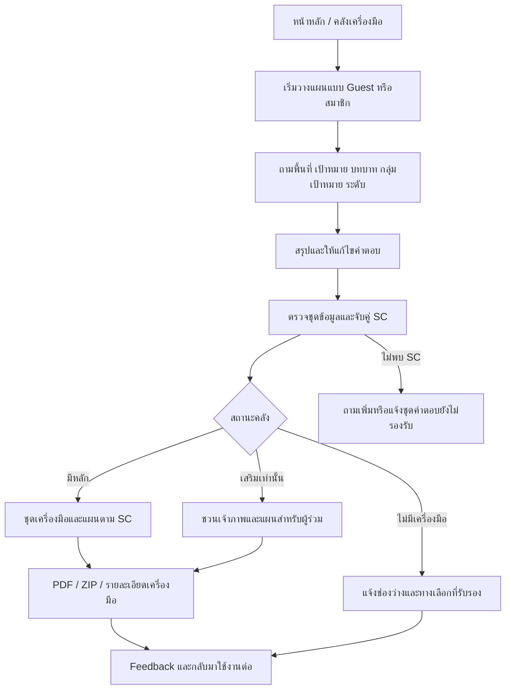

# Product Requirements Document (PRD)

# AI นักขับเคลื่อนพื้นที่ปลอดบุหรี่ไฟฟ้า

| รายการ | รายละเอียด |
|---|---|
| เวอร์ชัน | 0.2 — วิเคราะห์ใหม่จากไฟล์ภายในโปรเจค |
| วันที่ปรับปรุง | 23 กันยายน 2569 (2026-09-23) |
| สถานะ | ร่างละเอียดสำหรับทบทวนขอบเขต ออกแบบ พัฒนา และเตรียมรับรองเนื้อหา |
| ชื่อผลิตภัณฑ์ตาม Requirement | AI นักขับเคลื่อนพื้นที่ปลอดบุหรี่ไฟฟ้า |
| ชื่อที่ปรากฏในต้นแบบ | AI Package Assistant — ต้องยืนยันชื่อที่ใช้บนหน้าเว็บ |
| ผู้รับผิดชอบผลิตภัณฑ์ | ผู้แทนโครงการ / สสส. — รอระบุผู้อนุมัติ |
| ผลลัพธ์หลัก | ชุดเครื่องมือเฉพาะสถานการณ์ แผนปฏิบัติการ PDF และชุดดาวน์โหลด ZIP |
| ภาษาหลัก | ภาษาไทย |
| ฐานข้อมูลที่ตรวจ | 9 IP, 54 SC, 25 T, 16 บทบาท R ที่ใช้ในเส้นทาง |
| ข้อจำกัดสำคัญ | ไฟล์การ์ดเครื่องมือทั้งหมดเป็นเอกสารจำลอง; ขั้นตอนและเหตุผลหลายส่วนยังไม่ผ่านการรับรอง |

> เอกสารนี้ใช้ไฟล์จริงในโปรเจคแทนข้อสมมติใน PRD v0.1 แต่การอ่านไฟล์ได้ไม่เท่ากับเนื้อหานั้นผ่านการรับรองแล้ว ต้องแยก “โครงสร้างข้อมูลที่ตรวจพบ” ออกจาก “คำแนะนำที่เผยแพร่ให้ผู้ใช้จริงได้” อย่างชัดเจน

## 1. สรุปผลการวิเคราะห์ใหม่

### 1.1 ผลิตภัณฑ์ที่ต้องสร้าง

เว็บแอปช่วยผู้ขับเคลื่อนงานเลือกและนำ Intervention Package ไปใช้ตาม **พื้นที่ เป้าหมาย บทบาทผู้ดำเนินการ กลุ่มเป้าหมาย และระดับการดำเนินงาน** ผ่านบทสนทนาภาษาไทยที่มีตัวเลือกและคำถามตามบริบท ระบบจับคู่กับเส้นทางที่กำหนดไว้ แล้วแสดงเครื่องมือหลัก เครื่องมือเสริม เครื่องมือวัดผล และข้อมูลอ้างอิง พร้อมแผนลงมือทำและไฟล์ดาวน์โหลด

AI ทำหน้าที่ช่วยเข้าใจคำตอบ อธิบาย และเรียบเรียงจากเนื้อหาที่อนุญาต ส่วนการเลือกเส้นทาง การตรวจสิทธิ์ และขอบเขตเครื่องมือต้องตรวจด้วยกติกาของระบบ ไม่ให้โมเดลแต่งเครื่องมือหรือขยายคุณสมบัติการใช้งานเอง

### 1.2 สิ่งที่เปลี่ยนจาก v0.1

| ประเด็น | v0.1 | ข้อกำหนดหลังตรวจไฟล์ |
|---|---|---|
| เอกสารอ้างอิง | ยังอ่านลิงก์ไม่ได้ | อ่านไฟล์ท้องถิ่นครบ 37 ไฟล์ต้นทาง พร้อม PRD เดิม |
| การจัดหมวด | ใช้ M/F/C/H เป็นบริบทหลัก | แยกกลุ่มผู้ใช้เดิม M/F/C/H ออกจากพื้นที่ S1/S2/S3, บทบาท R, กลุ่มเป้าหมาย G, IP และ SC |
| จำนวนเนื้อหา | ยังไม่ทราบ | 9 IP, 54 SC, 25 เครื่องมือใช้งานตามทะเบียน; T02/T03/T17 ถูกตัดชั่วคราว |
| กติกาจับคู่ | เลือก Preset ที่เหมาะสมโดยทั่วไป | ใช้ตาราง SC เป็นฐานการจับคู่; แยกผลมีเครื่องมือหลัก 41 / เสริมอย่างเดียว 10 / ไม่มีเครื่องมือ 3 |
| แผนการดำเนินงาน | เสนอกิจกรรมตามบริบท | มีข้อมูลแผนรายเส้นทาง 54 แถว และขั้นตอน 306 แถวสำหรับ 51 เส้นทาง |
| ความพร้อม/ระยะเวลา | เสนอให้ถามเวลาและทรัพยากร | ไฟล์ Action plan รุ่นใหม่ระบุว่าตัดคำถามระยะเวลาและใช้ 3 เดือน; เรื่องทีมงานยังต้องยืนยัน |
| Login | เสนอ Login ก่อนเริ่ม | ภาพต้นแบบระบุ “ไม่ต้องสมัคร”; เปลี่ยนข้อเสนอเป็น Guest-first พร้อมสมาชิกแบบสมัครใจ |
| ZIP | เป็น P1 | ย้ายเป็น P0 เพราะคอนเซปต์มีปุ่มดาวน์โหลด ZIP ชัดเจน |
| Feedback | เน้นระยะถัดไป | เพิ่ม Feedback ขั้นต่ำใน P0 เพราะคอนเซปต์มี Feedback Loop และเนื้อหาแผนมี QR ติดตามผล |
| คุณภาพเนื้อหา | Preset ที่เผยแพร่เป็นฐานแนะนำ | ต้องมีสถานะจำลอง/รอยืนยัน/รับรอง แยกจาก Draft/Published |
| ดีไซน์/PDF | ยังไม่ล็อกแนวทาง | ตรวจภาพแล้ว ใช้เขียวอ่อน พื้นขาว/ครีม การ์ดโค้ง และผลลัพธ์ 6 ส่วน โดยต้องแก้ข้อความตัวอย่างที่ขัดข้อมูล |

### 1.3 ข้อเท็จจริงที่มีผลต่อการส่งมอบ

1. PDF เครื่องมือทั้ง 25 ไฟล์มีข้อความว่า **“เอกสารจำลองเพื่อทดสอบระบบ ยังไม่ใช่ข้อมูลจริงจาก สสส.”** และยังรอไฟล์เครื่องมือฉบับจริง จึงใช้ทดสอบระบบได้ แต่ไม่ควรเรียกว่าชุดเครื่องมือฉบับใช้งานจริงที่ได้รับครบแล้ว
2. ZIP มี 25 รายการ ซึ่งตรวจ SHA-256 แล้วตรงกับ PDF แยกรายชิ้นทั้งหมด ไม่ได้เพิ่มเครื่องมือใหม่ และไม่ใช่ ZIP เฉพาะแผนของผู้ใช้
3. ตารางเหตุผลแนะนำมี 86 คู่ SC–T แต่ตารางสถานการณ์มีการผูกเครื่องมือ 112 คู่ จึงขาดเหตุผลรายคู่ 26 รายการ ต้องเติมหรือกำหนดพฤติกรรมกรณีข้อมูลไม่ครบ
4. ตัวอย่างภาพใช้ Just Say No กับประถม แต่ทะเบียน T18 และ SC ระบุมัธยม ต้องใช้ภาพเป็นต้นแบบการจัดวาง ไม่ใช้ตัวอย่างนั้นเป็นกฎจับคู่
5. มีกรณีข้อความเจ้าภาพและกิจกรรมไม่ตรงบทบาทจริง ต้องแก้ข้อมูลก่อนเปิดเส้นทางที่ได้รับผลกระทบ

## 2. วิธีอ่านเอกสารและลำดับแหล่งอ้างอิง

### 2.1 ป้ายสถานะ

- **REQ:** ผู้ใช้ระบุโดยตรงใน Requirement เดิม เช่น Roles และสิทธิ์สมาชิก
- **SRC:** ตรวจพบในไฟล์จริง ระบุรหัสแหล่งข้อมูลและตำแหน่งประกอบ ไม่ได้หมายความว่าเจ้าของเนื้อหารับรองแล้ว
- **PROPOSED:** ข้อเสนอการออกแบบเพื่อให้พัฒนาได้ครบวงจร ต้องทบทวนก่อนล็อกขอบเขต
- **OPEN:** ข้อขัดแย้งหรือเรื่องที่ต้องตัดสินใจ
- **BLOCKER:** เงื่อนไขที่ต้องแก้ก่อนเปิดใช้งานจริงในส่วนที่เกี่ยวข้อง; ไม่จำเป็นต้องหยุดพัฒนาฟังก์ชันอื่น

ลำดับ P0/P1 ในเอกสารเป็นข้อเสนอการจัดงาน ไม่ใช่สัญญาด้านราคา เวลา หรือการอนุมัติเนื้อหาสุขภาพ

### 2.2 กติกาเลือกแหล่งข้อมูลเมื่อไม่ตรงกัน

| เรื่อง | แหล่งที่เสนอให้ยึด | กติกา |
|---|---|---|
| สิทธิ์ Admin1/Admin2/User | Requirement ข้อความ | คง Admin2 จัดการสมาชิกไม่ได้ |
| รหัส ขอบเขตเครื่องมือ และชุดที่จับคู่ได้ | L03 ชีต 00/02/03/04/04b | ใช้เป็นฐานตรวจ แต่รายการขัดกันต้องพักเพื่อรับรองก่อนเผยแพร่ |
| ขั้นตอนรายเส้นทางและกรอบเวลาแสดงผล | L04 | เป็นส่วนเสริมที่ใหม่กว่า L03; ไม่ทำให้ส่วนจำลองกลายเป็นข้อมูลรับรอง |
| กลุ่มเครื่องมือในผลลัพธ์เฉพาะคน | L03 ชีต 04 | รายการรวมระดับ IP ในชีต 05 ใช้อธิบายขอบเขต ไม่ใช้แจกทุกเครื่องมือให้ทุกคน |
| Layout/สี/ปุ่ม | L01/L02/L07/L08 | ไม่ใช้ภาพ Override อายุ กลุ่มเป้าหมาย หรือสิทธิ์เครื่องมือ |
| เรื่องที่ยังขัดกันหลังใช้กติกานี้ | เจ้าของผลิตภัณฑ์และเจ้าของเนื้อหา | บันทึกมติและเผยแพร่ข้อมูลรุ่นใหม่ ไม่แก้โดย AI เอง |

## 3. ทะเบียนไฟล์ที่อ่านและผลตรวจข้อมูล

### 3.1 ครอบคลุมไฟล์ในโปรเจค

ตรวจไฟล์ต้นทาง 37 ไฟล์: PDF 27, JPG 7, XLSX 2 และ ZIP 1 รวมกับ PRD เดิมเป็น 38 ไฟล์ ณ การเริ่มวิเคราะห์ ไฟล์ที่สร้างเพื่อช่วยวิเคราะห์ภายหลังไม่นับเป็นเอกสารต้นทาง

| รหัส | ไฟล์ | วิธีตรวจ/สิ่งที่ได้ |
|---|---|---|
| L00 | `PRD.md` v0.1 | ทบทวนข้อกำหนดและแทนที่ข้อสมมติที่ไม่ตรงเอกสารใหม่ |
| L01 | [ไฟล์คอนเซปต์เว็บแอป.pdf](<ไฟล์คอนเซปต์เว็บแอป.pdf>) | อ่านครบ 8 หน้า รวมหน้าที่เป็นภาพ; แนวคิด Flow 4 ขั้น ผลลัพธ์ PDF/ZIP และ Feedback Loop |
| L02 | [เรฟ.pdf](<เรฟ.pdf>) | ตรวจภาพ 1 หน้า; ตัวอย่าง Mobile UI ของ Pawly AI ใช้เป็นเรฟสี/รูปทรง/Chat ไม่ใช่ขอบเขตฟังก์ชันขายสินค้า |
| L03 | [1. intervention package V.2.xlsx](<ไฟล์ Preset/1. intervention package V.2.xlsx>) | อ่านข้อมูลทั้ง 9 ชีต รวมรหัส เครื่องมือ IP SC ข้อยกเว้น เนื้อหา 18 หัวข้อ และช่องว่าง |
| L04 | [2. action plan data V.1.xlsx](<ไฟล์ Preset/2. action plan data V.1.xlsx>) | อ่านข้อมูลทั้ง 7 ชีต; แผนราย SC ขั้นตอน เจ้าภาพ ส่งต่อ และเหตุผลเลือก |
| L05 | PDF 25 ไฟล์ใน `ไฟล์ เครื่องมือ (ประกอบเป็น Preset)` | อ่านทุกไฟล์: T01, T04–T16, T18–T28; รายชื่อในภาคผนวก B |
| L06 | [tools-all.zip](<ไฟล์ เครื่องมือ (ประกอบเป็น Preset)/tools-all.zip>) | ตรวจรายการและ Hash ครบ 25 ไฟล์ ทุกไฟล์ตรงกับ L05 |
| L07 | [ภาพผลลัพธ์ดาวน์โหลดแผน](<ไฟล์ภาพผลลัพธ์เมื่อกดดาวน์โหลดแผน PDF.jpg>) | ตรวจ 6 ส่วนหลักของแผนและ Timeline 4 ช่วง |
| L08-1 | [Screen Short design 1.jpg](<Screen Short design/Screen Short design 1.jpg>) | Header, Hero, CTA, ตัวอย่าง Chat, ข้อความ 5 ข้อ/25 ชิ้น/ใช้ฟรี |
| L08-2 | [Screen Short design 2.jpg](<Screen Short design/Screen Short design 2.jpg>) | วิธีใช้ 3 ขั้นและข้อความไม่ต้องสมัคร |
| L08-3 | [Screen Short design 3.jpg](<Screen Short design/Screen Short design 3.jpg>) | วัตถุประสงค์และการ์ดตัวเลข 25 เครื่องมือ/3 พื้นที่/16 บทบาท/2 ระดับ |
| L08-4 | [Screen Short design 4.jpg](<Screen Short design/Screen Short design 4.jpg>) | เครื่องมือหลัก/เสริม/วัดผล และตัวอย่างคลังเครื่องมือแยกพื้นที่ |
| L08-5 | [Screen Short design 5.jpg](<Screen Short design/Screen Short design 5.jpg>) | แหล่งสนับสนุน ช่องทางช่วยเลิก Child Impact และคลังความรู้ |
| L08-6 | [Screen Short design 6.jpg](<Screen Short design/Screen Short design 6.jpg>) | FAQ, CTA ท้ายหน้า, Footer และข้อความขอบเขตคำแนะนำ |

ลิงก์ออนไลน์เดิมเป็นแหล่งส่งมอบทางประวัติศาสตร์ ฉบับนี้ตรวจไฟล์ท้องถิ่นแล้ว จึงยกเลิกข้อความใน v0.1 ที่ระบุว่ายังไม่ทราบเนื้อหาของ Preset และดีไซน์ทั้งหมด อย่างไรก็ตาม ยังไม่ได้ยืนยันว่าไฟล์ท้องถิ่นตรงกับเวอร์ชันออนไลน์ล่าสุดทุกไฟล์

### 3.2 โครงสร้าง Workbook ที่ตรวจครบ

| Workbook / ชีต | ข้อมูลที่พบ | การใช้ในระบบ |
|---|---|---|
| L03 `00_พจนานุกรมรหัส` | ตระกูล S/MS/IP/R/G/T/SC, ตารางเทียบเลขเครื่องมือ, 3 เครื่องมือที่ตัดชั่วคราว | Master data และ Alias |
| L03 `01_มาตรการ_MS` | 12 มาตรการ/องค์ประกอบ | Mapping IP กับเป้าหมายระดับโครงการ |
| L03 `02_เครื่องมือ` | 25 แถวเครื่องมือ, 21 คอลัมน์ข้อมูล | Tool registry และ Metadata |
| L03 `03_เป้าหมาย_IP` | 9 IP และจำนวนสถานการณ์ราย IP | Package catalogue |
| L03 `04_สถานการณ์` | 54 SC แบ่งเครื่องมือเป็น 4 ช่อง | กติกาจับคู่หลัก |
| L03 `04b_ชุดที่ตัดออก` | 7 แถวข้อยกเว้น | Exclusion rules และการอธิบาย No match |
| L03 `05_เนื้อหาแผน` | 9 IP × 18 หัวข้อ = 162 รายการเนื้อหา | โครงสร้างแผนและคำอธิบายระดับ IP |
| L03 `06_ช่องว่างและตัวเลขสรุป` | สถิติและช่องว่าง 10 ประเด็น | Dashboard คุณภาพเนื้อหา |
| L03 `07_ข้อมูลที่ต้องขอ` | 11 รายการ แบ่ง 3 ระดับความจำเป็น | Content readiness checklist |
| L04 `00_อ่านก่อน` | ข้อจำกัดข้อมูลจำลองและกรอบเวลา 3 เดือน | กติกาใช้ข้อมูลชุดใหม่ |
| L04 `01_แผนรายเส้นทาง` | 54 แถว | งานของคุณ ข้อความผู้ช่วย เจ้าภาพ และ Timeline |
| L04 `02_ขั้นตอนรายเส้นทาง` | 306 แถว: 51 SC × 6 ขั้น | ตารางลงมือทำ; 3 SC ไม่มีเครื่องมือจึงไม่มีขั้นตอน |
| L04 `03_ขั้นตอนเครื่องมือ` | 100 แถว: 25 T × 4 ขั้น | รายละเอียดบนการ์ดเครื่องมือ |
| L04 `04_เจ้าภาพที่ควรชวน` | 10 แถว | ผลลัพธ์กรณีผู้ใช้เป็นผู้ร่วม |
| L04 `05_เส้นทางส่งต่อ` | 9 แถว ทุกแถวระบุว่าต้องยืนยันกับ สสส. | Referral content ที่ต้องรับรอง |
| L04 `06_เหตุผลที่เลือก` | 86 คู่ SC–T | เหตุผลบนการ์ด; ยังไม่ครบทุกคู่ที่ผูกไว้ |

จำนวนข้างต้นนับเฉพาะแถวข้อมูล ไม่นับชื่อชีต หัวตาราง หมายเหตุ และแถวรวม ตรวจค่าตัวเลขสำคัญซ้ำจากข้อมูล SC จริง ไม่อาศัยเพียงค่าที่ Cache ของสูตร Excel; พบสูตร 48 เซลล์ในไฟล์ แต่ไม่ได้แก้หรือคำนวณ Workbook ต้นฉบับใหม่

### 3.3 Baseline ที่ตรวจนับใหม่

| ตัวเลข | ผลตรวจ | ความหมาย |
|---|---:|---|
| พื้นที่ S | 3 | S1 สถานศึกษา, S2 ชุมชน, S3 สถานประกอบการ |
| สถานการณ์ S1 / S2 / S3 | 22 / 28 / 4 | รวม 54 เส้นทาง |
| IP | 9 | รายละเอียดหัวข้อ 5 |
| มีเครื่องมือหลัก | 41 | เริ่มดำเนินงานตามบทบาทได้เมื่อเนื้อหารับรองแล้ว |
| มีเฉพาะเครื่องมือเสริม | 10 | ต้องชวนเจ้าภาพตามเส้นทาง |
| ไม่มีเครื่องมือในคลัง | 3 | SC-017, SC-020, SC-023 |
| เครื่องมือ Active ตามทะเบียน | 25 | สถานะ Active ในตารางไม่ใช่สถานะอนุมัติ Production |
| ประเภทเครื่องมือ | 10 | เช่น คู่มือ เกม แบบประเมิน สื่อ กลไก/เครือข่าย |
| บทบาท R ที่ปรากฏใน SC | 16 | ไม่ใช่ Roles สำหรับกำหนดสิทธิ์ Admin |
| กลุ่ม G ที่นิยาม/ปรากฏใน SC | 10 / 8 | G06 และ G09 มีใน Metadata แต่ยังไม่มี SC เฉพาะ |
| เครื่องมือลงมือทำที่เป็นหลักอย่างน้อยหนึ่ง SC | 18 | อีก 7 ชิ้นเป็นแบบวัดผล 5 และอ้างอิง 2 |
| เครื่องมือรองรับป้องกัน / ดูแลผู้ใช้แล้ว | 23 / 9 | 16 ป้องกันอย่างเดียว + 7 ทั้งสองระดับ + 2 ดูแลอย่างเดียว; ห้ามบวกเป็น 32 ชิ้น |
| คู่ SC–T ใน 4 กลุ่ม | 112 | ความสัมพันธ์ ไม่ใช่จำนวนเครื่องมือไม่ซ้ำ |
| คู่ที่มีเหตุผลใน L04 | 86 | อีก 26 คู่ยังไม่มีเหตุผลเฉพาะในชีตนี้ |

### 3.4 ข้อมูลที่ยังไม่ได้รับ

- คู่มือ/ไฟล์กิจกรรมฉบับจริงของเครื่องมือ 25 ชิ้น พร้อมเจ้าของและสิทธิ์เผยแพร่; ไฟล์ปัจจุบันเป็นการ์ดจำลอง
- ไฟล์แผน `IP-01.pdf` ถึง `IP-09.pdf` ที่ตารางอ้างถึงไม่ได้อยู่ในโปรเจค การส่งออกแผนใหม่จึงต้องสร้างจากข้อมูล ไม่เปิดลิงก์ไปยังไฟล์ที่ไม่มี
- เอกสารต้นฉบับ Flagship 11 พ.ค., แผนภาพโมเดล 23 มิ.ย. และ Flow v.1 ที่ Workbook กล่าวถึง ไม่ได้เป็นไฟล์แยกที่ส่งมาให้ตรวจ
- โลโก้ ฟอนต์หรือข้อกำหนดแบรนด์ฉบับใช้งานจริง และปลายทางลิงก์สนับสนุนที่รับรองแล้ว
- พจนานุกรมบทบาทครบ 24 รหัสและถ้อยคำกลุ่มเป้าหมายที่ยืนยันครบ 10 กลุ่ม
- นโยบายข้อมูล วิธีสมัครสมาชิก และข้อยุติการรองรับผู้ใช้ที่เป็นเยาวชน

## 4. เป้าหมาย ผู้ใช้ และสิทธิ์

### 4.1 เป้าหมายผลิตภัณฑ์

1. ให้ผู้ใช้เลือกเส้นทางที่ตรงบทบาทและกลุ่มเป้าหมายได้โดยไม่ต้องอ่านเครื่องมือทุกชิ้นเอง
2. ให้ได้คำแนะนำว่าควรเริ่มจากอะไร ใครควรเป็นเจ้าภาพ ต้องทำเมื่อไร ที่ไหน และได้ผลผลิตอะไร
3. ทำให้สถานการณ์ที่ไม่มีเครื่องมือหรือมีเพียงเครื่องมือเสริมได้รับคำตอบที่ตรงไปตรงมา
4. ดาวน์โหลดแผนและชุดไฟล์เฉพาะเส้นทางที่ตรวจย้อนกลับได้
5. ส่งข้อมูลรวมเรื่องการเข้าถึง การนำไปใช้ และช่องว่างของคลังกลับให้ผู้ดูแลและ สสส.

คอนเซปต์ระบุ “แผนพร้อมใช้ใน 2 นาที” ให้ถือเป็นเป้าหมาย UX สำหรับทดสอบกับผู้ใช้ ไม่ใช่การรับประกันทุกกรณี และไม่ใช่เวลาที่ AI ใช้สร้างข้อความเพียงอย่างเดียว

### 4.2 สิทธิ์ระบบตาม Requirement

| ความสามารถ | Admin1 — คนทำระบบ | Admin2 — สสส. | User/Guest |
|---|---|---|---|
| Dashboard ภาพรวม | ได้ | ได้ | ไม่ได้ |
| จัดการ Preset/IP/SC/เครื่องมือ | ได้ | ได้ | ไม่ได้ |
| จัดการ Template และข้อความแสดงผล | ได้ ตามข้อเสนอ | ได้ ตามข้อเสนอ | ไม่ได้ |
| Preview และรับรอง/เผยแพร่เนื้อหา | ได้ตาม Workflow | ได้ตาม Workflow | ไม่ได้ |
| จัดการสมาชิก เปลี่ยน Role ระงับบัญชี | ได้ | ไม่ได้ | ไม่ได้ |
| Chatbot และผลลัพธ์ | ผ่าน Preview/บัญชีทดสอบ | ผ่าน Preview/บัญชีทดสอบ | ได้ตาม Session ของตน |
| PDF/ZIP เฉพาะแผน | ตามสิทธิ์ของ Session/แผน | ตามสิทธิ์ของ Session/แผน | ของตน |
| ประวัติแผนข้ามอุปกรณ์ | ตามบัญชีที่เปิดใช้ | ตามบัญชีที่เปิดใช้ | เฉพาะสมาชิก หากทำฟังก์ชันนี้ |
| ดูประวัติการแก้เนื้อหา | ได้ | ได้ | ไม่ได้ |
| ดูประวัติการจัดการสมาชิก | ได้ | ไม่ได้ | ไม่ได้ |
| เปิดบทสนทนาหรือแผนส่วนตัวของผู้อื่น | ไม่เปิดเป็นค่าเริ่มต้น | ไม่เปิดเป็นค่าเริ่มต้น | ไม่ได้ |

การมีสิทธิ์แก้ Preset ไม่เท่ากับการเป็นผู้เชี่ยวชาญผู้รับรองโดยอัตโนมัติ ต้องระบุผู้รับผิดชอบเนื้อหาใน Workflow สิทธิ์สมาชิกตรวจฝั่ง Server ทุกครั้ง รวม API และไฟล์ ห้ามผู้สมัครเลือก Admin เอง และห้ามระงับ/ลดสิทธิ์ Admin1 คนสุดท้ายโดยไม่มีผู้ดูแลทดแทน

### 4.3 แยกมิติผู้ใช้เพื่อไม่ให้รหัสปะปน

| มิติ | ใช้ทำอะไร | ค่า/ตัวอย่าง |
|---|---|---|
| `access_role` | สิทธิ์เข้าถึงระบบ | Admin1, Admin2, User |
| `audience_context` | กลุ่มผู้ใช้ตาม Requirement เดิม | M สถานศึกษา, F ครอบครัว, C ชุมชน, H ระบบบริการสุขภาพ |
| `setting_code` | พื้นที่ระดับชุดโครงการในไฟล์ | S1 สถานศึกษา, S2 ชุมชน, S3 สถานประกอบการ |
| `operator_role_code` | ผู้ที่จะลงมือใช้เครื่องมือ | R02 ครู/อาจารย์, R11 ผู้ปกครอง เป็นต้น |
| `target_group_code` | ผู้รับผลของกิจกรรม | G02 ประถม, G03 มัธยม เป็นต้น |
| `intervention_level` | ระดับการดำเนินงาน | ป้องกัน / ดูแลคนที่ใช้แล้ว |
| `package_code` | เป้าหมาย/แพ็กเกจแผน | IP-01 ถึง IP-09 |
| `scenario_code` | ชุดเงื่อนไขและเครื่องมือเฉพาะเส้นทาง | SC-001 ถึง SC-054 |

**PROPOSED:** คง M/F/C/H เป็นมิติรายงาน/การเริ่มเข้าถึง ไม่ใช้แทน S และไม่บังคับให้ผู้ใช้ตอบรหัสสองชุดซ้ำกัน หน้าเริ่มแสดงชื่อพื้นที่ที่เข้าใจง่ายและมีทางลัด “ครอบครัว/บ้าน” กับ “ระบบบริการสุขภาพ” เข้าสู่ IP-05/IP-08 ซึ่งในฐานข้อมูลจัดอยู่ S2 ส่วน S3 ให้คงเป็นสถานประกอบการ ไม่แปลงเป็น M โดยพลการ

**OPEN:** Requirement เดิมยังไม่มีหมวดผู้ใช้สถานประกอบการ ต้องยืนยันว่าจะเพิ่มหมวดแสดงผลหรือให้ `audience_context` ว่าง/ไม่จัดกลุ่มสำหรับเส้นทาง S3 โดยไม่กระทบสิทธิ์ User; การออกแบบฐานข้อมูลต้องรองรับสองกรณีนี้ได้

### 4.4 บทบาทที่มีเส้นทางรองรับจริง

| กลุ่ม | รหัสและชื่อ |
|---|---|
| สถานศึกษา | R01 ผู้บริหารสถานศึกษา; R02 ครู/อาจารย์; R03 บุคลากรในสถานศึกษา; R06 แกนนำนักเรียน; R07 แกนนำนักศึกษา; R08 ทีมผู้บริหารและครู |
| ครอบครัว/ชุมชน/สุขภาพ | R10 เจ้าหน้าที่สาธารณสุข; R11 ผู้ปกครอง; R13 แกนนำชุมชน; R14 แกนนำ อปท.; R15 อสม.; R16 เภสัชกรปฐมภูมิ; R18 แกนนำชุมชนมุสลิม; R19 คณะกรรมการมัสยิด |
| สถานประกอบการ | R23 บุคลากรในสถานประกอบการ; R24 แกนนำในสถานประกอบการ |

ตาราง Exclusion ระบุ R04/R05/R09/R12/R17/R20/R21 ถูกตัดเพราะไม่มีเครื่องมือหลัก ส่วน R22 ไม่อยู่ใน 16 บทบาทและไม่มีคำอธิบายตัดออกในแถวเดียวกัน ต้องขอ Dictionary ครบก่อนนำเข้า ห้ามสร้างชื่อบทบาทที่หายไปเอง

### 4.5 กลุ่มเป้าหมาย

G01 เด็กเล็ก (ศพด.), G02 นักเรียนประถม, G03 นักเรียนมัธยม, G04 นักศึกษาอุดมศึกษา, G05 นักเรียนอาชีวศึกษา, G06 เยาวชนนอกระบบการศึกษา, G07 พนักงาน/วัยทำงาน, G08 ประชากรกลุ่มเฉพาะ (ชุมชนมุสลิม), G09 ผู้สูงอายุ และ G10 ประชาชนทั่วไป

G06/G09 ปรากฏใน Metadata เครื่องมือแต่ไม่มี SC เฉพาะใน 54 เส้นทาง การเลือกกลุ่มเหล่านี้ต้องเข้าสู่ Unsupported combination หรือเส้นทางที่เจ้าของเนื้อหาอนุมัติเพิ่ม ห้ามเหมารวมเป็น G10 เพื่อให้ระบบตอบสำเร็จ

## 5. แพ็กเกจและโครงสร้างความรู้

### 5.1 รายการ IP ทั้ง 9 ชุด

| IP | ชื่อแพ็กเกจ | S / MS | SC ทั้งหมด | หลัก / เสริม / ไม่มี | ข้อจำกัดสำคัญจากต้นทาง |
|---|---|---|---:|---|---|
| IP-01 | สถานศึกษาปลอดบุหรี่ไฟฟ้าทั้งระบบ | S1; MS1/MS2/MS3 | 8 | 8 / 0 / 0 | MS2/MS3 ยังไม่มีเครื่องมือเฉพาะ ใช้หัวข้อใน T01 |
| IP-02 | ห้องเรียนรู้เท่าทันบุหรี่ไฟฟ้า | S1; MS4 | 6 | 5 / 1 / 0 | ไม่มีชุดการสอนสำหรับอุดมศึกษา; อาชีวะใช้ระดับดูแลผู้ที่ใช้แล้ว |
| IP-03 | แกนนำเยาวชนขับเคลื่อนเอง | S1; MS5 | 2 | 2 / 0 / 0 | ยังไม่มีคู่มือจริงขั้นตอนตั้งชมรม |
| IP-04 | ดูแลช่วยเหลือผู้ที่ใช้แล้วในสถานศึกษา | S1; MS6 | 6 | 2 / 2 / 2 | มัธยมยังไม่มีเครื่องมือดูแลผู้ใช้แล้วโดยตรง |
| IP-05 | บ้านปลอดควัน ครอบครัวช่วยเลิก | S2; MS-F1 | 7 | 6 / 0 / 1 | ผู้ปกครองเด็กเล็กไม่มีเครื่องมือหลังตัด T17 |
| IP-06 | ชุมชนและศาสนสถานปลอดบุหรี่ไฟฟ้า | S2; MS-C1/MS-C2 | 10 | 7 / 3 / 0 | ไม่มีแนวปฏิบัติสำหรับวัดและเครื่องมือเฝ้าระวังร้านค้า/ออนไลน์เฉพาะ |
| IP-07 | สื่อสารรณรงค์ในงานและเทศกาลชุมชน | S2; MS-C3/MS7 | 8 | 6 / 2 / 0 | ต้องยืนยันบริบท T15 และวิธียืมนิทรรศการ T23 |
| IP-08 | เชื่อมระบบช่วยเลิกในระบบบริการสุขภาพ | S2; MS-H1 | 3 | 3 / 0 / 0 | SC มี T28 ชิ้นเดียว; ไม่มีแนวทางบำบัด/ติดตามฉบับจริงในคลัง |
| IP-09 | สถานประกอบการปลอดบุหรี่ไฟฟ้า | S3; ไม่มี MS ในโมเดลที่อ้าง | 4 | 2 / 2 / 0 | เป็นชุดเพิ่มจากคอนเซปต์; เส้นทางดูแลผู้ใช้แล้วมีปัญหาเจ้าภาพข้ามบริบท |
| รวม | | | 54 | 41 / 10 / 3 | จำนวนนี้เป็น Baseline ของข้อมูล ไม่ใช่จำนวนเส้นทางพร้อมเปิดจริง |

### 5.2 รหัสมาตรการและรูปแบบการทำงาน

- MS1 นโยบาย; MS2 บริหารจัดการ; MS3 สภาพแวดล้อม; MS4 การสอน; MS5 การมีส่วนร่วมนักเรียน; MS6 ดูแลช่วยเหลือนักเรียน; MS7 กิจกรรมร่วมโรงเรียน–ชุมชน
- MS-F1 บ้านปลอดควัน; MS-C1 ศาสนสถานปลอดควัน; MS-C2 ZONING; MS-C3 สื่อสารในงานชุมชน; MS-H1 เชื่อมระบบบริการสุขภาพ
- L01 หน้า 4 มี 6 รูปแบบตามกรอบ Ottawa ได้แก่ Personal Skills Prevention, Personal Skills Cessation, Supportive Environment, Community Action, Healthy Public Policy และ Health Services Reorient
- L03 ระบุว่าตั้งรหัส MS เพื่อไม่ชนกับ M1–M6 ใน Flow เดิม จึงต้องเก็บ `strategy_code` ของกรอบดังกล่าวแยกจาก MS และจากกลุ่มผู้ใช้ M
- **OPEN:** ยังไม่มีตาราง Mapping ที่รับรองระหว่าง 6 รูปแบบกับ 9 IP/54 SC ไม่เพิ่มชั้นการตัดสินใจนี้เป็นกฎบังคับจนกว่าเจ้าของเนื้อหาจะยืนยัน โดยเก็บเป็น Metadata ได้

### 5.3 บทบาทเครื่องมือขึ้นกับเส้นทาง

แต่ละ SC มี 4 กลุ่ม: ① หลัก ② เสริม ③ วัดผล ④ อ้างอิง เครื่องมือหลักอาจมีหลายชิ้น เช่น SC-011 มี T08/T16/T18 จึงห้ามออกแบบฐานข้อมูลว่ามี `primary_tool_id` ได้เพียงค่าเดียว

ป้ายทั่วไปของเครื่องมือไม่ใช่ป้ายของทุกเส้นทาง ตัวอย่าง T20/T22 มีป้ายทั่วไปเป็นเสริม แต่เป็นหลักในบาง SC ต้องเก็บบทบาทไว้ที่ความสัมพันธ์ `ScenarioTool` และใช้ความสัมพันธ์นั้นแสดงผล ส่วน “เริ่มจากชิ้นนี้” เป็นลำดับแนะนำ ไม่ได้เปลี่ยนเครื่องมือหลักชิ้นอื่นให้เป็นเครื่องมือเสริม

### 5.4 รหัสเครื่องมือและการย้ายข้อมูล

ใช้ T เป็น ID มาตรฐาน ห้ามใช้ลำดับแถวหรือเลขในภาพเป็น Primary key ตัวอย่าง Alias ที่ต่างกัน: T16 เคยเป็นเลข 25 ในแผนภาพ, T24 เป็นเลข 16, T25 เป็นเลข 26, T26 เป็นเลข 27, T27 เป็นเลข 26 วงกลาง และ T28 เป็นเลข 24 ต้องเก็บที่มาของ Alias เพื่อป้องกันสลับเครื่องมือ

T02 G-RDU, T03 CIB และ T17 Survival Kit 7+1 ให้มีสถานะ `excluded_pending_review` ไม่ลบประวัติ ไม่สร้างไฟล์เปล่าทดแทน และไม่นำกลับมาใช้จนได้รับข้อยุติ

## 6. ขอบเขต MVP และระยะถัดไป

| รหัส | ความสามารถ | ลำดับ | ที่มา/สถานะ |
|---|---|---|---|
| SCP-01 | Landing page, วิธีใช้, ตัวอย่างคลัง, FAQ และแหล่งสนับสนุน | P0 | SRC L08 |
| SCP-02 | Guided Chat ตามบริบทและสรุปคำตอบก่อนสร้าง | P0 | REQ + SRC L01 |
| SCP-03 | จับคู่ IP/SC และผลลัพธ์ครบ 3 สถานะของคลัง | P0 | SRC L03/L04 |
| SCP-04 | แผน 4 ช่วงและขั้นตอนลงมือราย SC | P0 | SRC L04 |
| SCP-05 | การ์ดเครื่องมือ 4 กลุ่ม เหตุผล ขั้นตอน และข้อจำกัด | P0 | SRC L03/L04 |
| SCP-06 | PDF แผนเฉพาะคนและ ZIP เฉพาะชุด | P0 | SRC L01/L07 |
| SCP-07 | หลังบ้าน IP/SC/เครื่องมือ/คำถาม/สถานะเนื้อหา/เวอร์ชัน | P0 | REQ + PROPOSED รายละเอียด |
| SCP-08 | Dashboard การใช้งานและช่องว่างคลัง | P0 | REQ + SRC Feedback Loop |
| SCP-09 | สมาชิกและสิทธิ์ Admin1/Admin2 | P0 | REQ |
| SCP-10 | Guest เริ่มทำแผนและดาวน์โหลดได้ | P0 ที่เสนอ | SRC ไม่ต้องสมัคร; วิธีเก็บ Session ต้องตกลง |
| SCP-11 | Feedback ขั้นต่ำจากหน้าแผนและ QR/ลิงก์ | P0 | SRC L01/L03; แบบฟอร์มเสนอ |
| SCP-12 | นำเข้า Excel แบบตรวจสอบก่อนเผยแพร่ | P0 | PROPOSED เพื่อลดการกรอกซ้ำและรักษารหัส |
| SCP-13 | ประวัติข้ามอุปกรณ์ของสมาชิกและการผูกแผน Guest | P1 | PROPOSED; ยกระดับได้ถ้าต้องใช้ใน Pilot |
| SCP-14 | รายงาน CSV แบบรวมและคะแนนความพึงพอใจละเอียด | P1 | PROPOSED |
| SCP-15 | เลือกระยะเวลา/ทีม/งบเพื่อปรับแผนอัตโนมัติ | P1 หลังรับรองกฎ | คอนเซปต์เก่ามี แต่ L04 ตัดระยะเวลาออกแล้ว |
| SCP-16 | แจ้งเตือนติดตามผลผ่าน Email/LINE อัตโนมัติ | ระยะถัดไป | ยังไม่มีข้อกำหนดช่องทางและความยินยอม |
| SCP-17 | ทีมร่วมแก้แผน แชร์สาธารณะ หลายภาษา เชื่อมระบบภายนอก | ระยะถัดไป | ไม่รวม MVP |

### 6.1 ไม่รวมใน MVP

- การวินิจฉัย สั่งยา หรือให้คำปรึกษาทางคลินิกเฉพาะบุคคลโดย AI
- การเก็บรายชื่อผู้สูบ เด็ก ผู้ป่วย หรือเวชระเบียน และการติดตามเคสจริงในเว็บนี้
- การสร้างแบบประเมินที่ไม่มีในคลัง หรืออ้างว่าผลแบบสอบถามที่ AI แต่งมีความเที่ยงตรง
- ระบบยืม/จองนิทรรศการหรือสั่งซื้ออุปกรณ์เต็มรูปแบบ; MVP แสดงวิธีเข้าถึงที่รับรองแล้ว
- การเปิดแผนเดียวรวมหลาย IP โดย AI อิสระ; ใช้ 1 SC หลักและอ้างเส้นทางส่งต่อได้
- การเชื่อม Canva/Drive/TUM/Uni-Health/Child Impact ผ่าน API โดยอัตโนมัติ เพียงมีชื่อเครื่องมือไม่เท่ากับต้อง Integrate ระบบนั้น
- การพิสูจน์ผลลดสูบบุหรี่ไฟฟ้าจากจำนวน Chat หรือดาวน์โหลด

## 7. User Journey และ Template คำถาม

### 7.1 เส้นทางหลักที่เสนอ



หากเนื้อหาของ SC ยังเป็นจำลองหรือมีข้อขัดแย้ง ระบบ Production ต้องแสดงว่าเนื้อหานี้ยังไม่พร้อมเผยแพร่ แยกจากกรณีไม่มีเครื่องมือในคลัง ผู้ดูแลยัง Preview ด้วยป้ายจำลองได้

### 7.2 คำถามหลัก 5 มิติ

ภาพ Landing ระบุ “ตอบคำถามสั้น ๆ 5 ข้อ” แต่ยังไม่มี Template ฉบับรับรองครบทุก Branch จึงเสนอ 5 มิติต่อไปนี้ โดยนับคำถามยืนยัน/แก้ข้อมูลแยกจากคำถามหลัก

| ลำดับ | คำถามแสดงผลที่เสนอ | ฟิลด์ | แหล่งตัวเลือกและเงื่อนไข |
|---|---|---|---|
| Q1 | คุณต้องการเริ่มขับเคลื่อนจากพื้นที่ใด? | `setting_code` + บริบทย่อย | S1/S2/S3 และทางลัดบ้าน/บริการสุขภาพ; ไม่ใช้ชื่อหน่วยงานจริงเป็นฟิลด์บังคับ |
| Q2 | อยากให้เกิดการเปลี่ยนแปลงเรื่องใดเป็นหลัก? | `package_code` / เป้าหมาย | IP ที่สัมพันธ์กับพื้นที่; แสดงชื่อและคำอธิบายง่าย |
| Q3 | คุณมีบทบาทใดในการดำเนินงานนี้? | `operator_role_code` | R ที่มีใน SC ของเป้าหมาย; มี “ยังไม่ตรงกับตัวเลือก” เพื่อไม่บังคับเลือกเท็จ |
| Q4 | ต้องการทำงานกับกลุ่มใด? | `target_group_code` | G ตามเส้นทางที่เป็นไปได้; กลุ่มที่ยังไม่รองรับต้องมีข้อความอธิบาย |
| Q5 | งานนี้เน้นป้องกันไม่ให้เริ่มใช้ หรือดูแลกลุ่มที่ใช้แล้ว? | `intervention_level` | 2 ระดับ; ถ้า IP บังคับระดับเดียวให้ยืนยันแบบสั้น ไม่ถามซ้ำโดยไม่จำเป็น |

ลำดับ Q2–Q5 อาจปรับตาม Prototype ได้ แต่ต้องเก็บข้อมูลครบสำหรับจับคู่ `IP × R × G × level` และตรวจ S ที่ผูกกับ IP ห้ามใช้เพียงบทบาท+กลุ่มเป้าหมาย เพราะบางคู่ตรงหลาย IP เช่น ครูอาชีวะกับ T19 อยู่ทั้ง IP-02 และ IP-04

### 7.3 ข้อมูลเพิ่มเติม

- คำบรรยายปัญหาและสิ่งที่ทำได้: ไม่บังคับ ใช้ช่วยเรียบเรียงและถามยืนยัน ไม่เพิ่มสิทธิ์ใช้เครื่องมือ
- ระยะเวลา: ค่าเริ่มต้น 3 เดือนตาม L04 `00_อ่านก่อน` A18 ไม่แสดงราวกับผู้ใช้ตอบว่ามีเวลา 3 เดือน
- ทีมงาน: L01 มีตัวเลือกคนเดียว/2–5 คน/ระดับองค์กร/เครือข่าย แต่ไม่มีเงื่อนไขปรับแผนที่รับรอง จึงยังไม่เป็นคำถามบังคับของ MVP
- งบประมาณ/จำนวนผู้ร่วมกิจกรรม: ยังไม่มีข้อมูล Mapping ในไฟล์ หากเพิ่มในอนาคตต้องมีเหตุผลใช้ข้อมูลชัดเจน
- วันเริ่ม: ไม่บังคับ; ถ้าไม่ระบุให้ใช้สัปดาห์/เดือนสัมพัทธ์ ไม่สร้างวันที่ปฏิทินขึ้นเอง
- เงื่อนไขเฉพาะเครื่องมือ เช่น T14 ในพื้นที่ชาติพันธุ์: ถามเพิ่มเติมเมื่อจำเป็นต่อความเหมาะสม โดยถามบริบทการทำงาน ไม่ขอข้อมูลชาติพันธุ์ส่วนบุคคลของผู้ตอบโดยไม่จำเป็น

### 7.4 พฤติกรรม Chat

| รหัส | ข้อกำหนด | เกณฑ์ยอมรับ |
|---|---|---|
| FR-CHAT-01 | ถามตาม Template รุ่นที่เผยแพร่ | Session บันทึก Template version และคำตอบมีชนิดข้อมูลชัดเจน |
| FR-CHAT-02 | รองรับปุ่มตัวเลือกและคำอธิบายข้อความ | AI แปลงข้อความเป็นรหัสที่มีจริงและให้ผู้ใช้ยืนยันเมื่อกำกวม |
| FR-CHAT-03 | แก้คำตอบย้อนหลังได้ | ประเมิน Branch ใหม่และแจ้งคำตอบที่ใช้ต่อไม่ได้ |
| FR-CHAT-04 | สรุปก่อนสร้าง | แสดงพื้นที่ เป้าหมาย บทบาท กลุ่ม ระดับ และค่าเริ่มต้น 3 เดือนครบ |
| FR-CHAT-05 | แสดงความคืบหน้า | ใช้จำนวนคำถามที่ใช้จริงใน Branch ไม่ค้างที่ 5/5 ทั้งที่ยังขาดเงื่อนไข |
| FR-CHAT-06 | ไม่บังคับกรอกข้อมูลที่ไม่มี | เลือกยังไม่ทราบได้ในฟิลด์ไม่จำเป็น; ฟิลด์จับคู่ต้องขอคำตอบก่อน |
| FR-CHAT-07 | บันทึกระหว่างทาง | ระบุสถานะบันทึก และเปิดต่อใน Session เดิมได้ภายในอายุที่กำหนด |
| FR-CHAT-08 | ข้อความนอกขอบเขตไม่เปลี่ยนกฎ | อธิบายขอบเขตแล้วกลับมาที่ข้อมูลจำเป็น |

### 7.5 Guest และสมาชิก

**PROPOSED จากภาพไม่ต้องสมัคร:** Guest เริ่มตอบ ดูผล และดาวน์โหลดได้ภายใน Session ที่ป้องกันการเข้าถึง ไม่ใช้รหัส SC หรือรหัสแผนที่เดาได้เป็นหลักฐานสิทธิ์ มีปุ่มล้างข้อมูลบนอุปกรณ์และแจ้งอายุการเก็บเมื่อเริ่มใช้

สมาชิกเป็นทางเลือกสำหรับประวัติและข้ามอุปกรณ์ หากเปิดการผูกแผน Guest ต้องพิสูจน์การครอบครอง Session เดิม ไม่รับแค่ `plan_id` จาก Browser วิธี Auth, อายุ Session, การสมัคร และรายละเอียด Guest เป็นเรื่องรอยืนยัน ส่วน Admin ต้อง Login ทุกครั้งตามนโยบาย Session ที่กำหนด

เนื้อหามีบทบาทแกนนำนักเรียน/นักศึกษา จึงไม่ควรสรุปว่าผู้ใช้ทุกคนเป็นผู้ใหญ่ ต้องตัดสินใจแนวทางใช้งานของเยาวชนก่อน Pilot โดยไม่เก็บวันเกิดหรือข้อมูลระบุตัวมากเกินจำเป็น

## 8. กติกาจับคู่และการประกอบแผน

### 8.1 ลำดับประมวลผล

1. รับ Snapshot คำตอบที่ยืนยันแล้วและรุ่นชุดข้อมูลที่เปิดใช้งาน
2. ตรวจ Schema/รหัส/ความสัมพันธ์ S–IP–R–G–level และ Exclusion rules
3. ค้น SC ที่ตรงครบทุกเงื่อนไข; หากหลายรายการให้ถามเป้าหมายเพิ่ม ไม่สุ่มเลือก
4. ตรวจสถานะเนื้อหา: เส้นทาง เครื่องมือ ขั้นตอน เหตุผล และ Referral ต้องผ่านเกณฑ์เผยแพร่ของส่วนนั้น
5. อ่านสถานะ `primary_available`, `support_only` หรือ `no_tool` จากข้อมูลที่ตรวจแล้ว
6. ประกอบ 4 กลุ่มเครื่องมือตาม `ScenarioTool`; แยกข้อมูลเกี่ยวข้องทั่วไปออกจากสิ่งที่เลือกให้ผู้ใช้จริง
7. ดึงแผน 4 ช่วงจาก L04 ชีต 01 และขั้นตอนจากชีต 02 ตาม SC เดียวกัน
8. ดึงเจ้าภาพตามชีต 04, รายละเอียดเครื่องมือตามชีต 03, เหตุผลตามชีต 06 และ Referral ตามชีต 05
9. ให้ AI เรียบเรียงเฉพาะฟิลด์ที่อนุญาต พร้อมตรึง IDs และเนื้อหาที่ต้องคงไว้
10. Validator ตรวจข้ามส่วนก่อนบันทึก PlanRevision และเปิดให้ดาวน์โหลด

### 8.2 ผลลัพธ์ที่ต้องแยกให้ชัด

| สถานะ | เงื่อนไข | ผลลัพธ์/CTA |
|---|---|---|
| มีเครื่องมือหลัก | 41 SC ตาม Baseline | แสดงหลักทั้งหมดและลำดับเริ่ม แผน ขั้นตอน PDF/ZIP |
| มีเฉพาะเสริม | 10 SC | แสดงข้อความว่าผู้ใช้เป็นผู้ร่วม ชวนเจ้าภาพก่อนเริ่ม และคงป้ายเสริมของเครื่องมือ |
| ไม่มีเครื่องมือในคลัง | SC-017/020/023 | อธิบายช่องว่าง ไม่สร้าง 4 ช่วงหรือขั้นตอนหลอก; แสดงทางเลือกที่รับรองและช่อง Feedback |
| ยังไม่รองรับชุดคำตอบ | ไม่พบ SC | แสดงเงื่อนไขที่ยังไม่ครอบคลุมและให้กลับแก้เฉพาะข้อมูลจริง; ไม่บังคับเปลี่ยนกลุ่มเพื่อให้ได้แผน |
| เนื้อหายังไม่พร้อม | มี SC แต่ยังจำลอง/ขัดกัน/ขาดไฟล์สำคัญ | แจ้งยังไม่พร้อมเผยแพร่ แยกจากไม่มีเครื่องมือ; Admin เปิด Preview ได้ |
| ระบบขัดข้อง | ฐานข้อมูล/AI/งานส่งออกผิดพลาด | เก็บคำตอบและให้ลองใหม่ ไม่รายงานเป็นช่องว่างคลัง |

สำหรับ `no_tool` ไม่เปิดปุ่ม ZIP ว่างหรือปุ่ม “ดาวน์โหลดแผนพร้อมใช้” ที่ทำให้เข้าใจผิด อาจมี PDF “สรุปสถานการณ์และข้อจำกัด” หากเจ้าของผลิตภัณฑ์เลือกทำ โดยต้องตั้งชื่อและสถานะชัดเจน

### 8.3 กฎสำคัญเฉพาะข้อมูลชุดนี้

| รหัส | กฎ | ตัวอย่างตรวจ |
|---|---|---|
| BR-01 | ใช้ SC เป็นรายการอนุญาตของเครื่องมือเฉพาะสถานการณ์ | SC-010 ได้ T08/T16 และ T09/T12 ไม่ได้ T18 จากภาพตัวอย่าง |
| BR-02 | เครื่องมือหลักมีหลายชิ้นได้ | SC-003 ต้องไม่ตก T05 เพราะ UI แสดงแค่ 2 ใบ |
| BR-03 | คงบทบาทหลัก/เสริมตาม SC | SC-014/021 มี T19 เสริม และต้องชวนครู |
| BR-04 | ไม่เติมเครื่องมือจากข้อความกว้างระดับ IP | IP-04 หัวข้อ 9 พูดถึง T28 แต่ SC-017 ยังเป็นไม่มีเครื่องมือ |
| BR-05 | ไม่ใช้เครื่องมือวัดผลเป็นกิจกรรมหลักเพื่อปิดช่องว่าง | ห้ามให้ T11 กลายเป็นชุดช่วยเลิกเพียงเพราะมีไฟล์ |
| BR-06 | เครื่องมืออ้างอิงไม่ต้องเป็นกิจกรรมลงมือทุกครั้ง | T25/T26 อยู่กลุ่มอ้างอิงตาม SC ที่ระบุ |
| BR-07 | IP-08 รองรับระดับดูแลคนที่ใช้แล้วเท่านั้น | ไม่สร้าง SC ใหม่สำหรับระดับป้องกัน |
| BR-08 | อายุ/กลุ่มเป้าหมายเป็นข้อจำกัด | T24 ครู ศพด. ไม่กลายเป็นเครื่องมือสำหรับผู้ปกครองเด็กเล็ก SC-023 |
| BR-09 | “ใช้คู่กับ” และ “ทุก IP” ไม่ใช่สิทธิ์ใส่ทุกแผน | T24 ระบุใช้คู่ T11 แต่ G01 ไม่อยู่กลุ่ม T11; ห้าม Auto-add |
| BR-10 | ความเหมาะสมของเครื่องมือเฉพาะบริบทต้องตรวจเพิ่ม | T14 ต้องมีเงื่อนไขพื้นที่ชาติพันธุ์ที่รับรอง ไม่ใส่ทุกมัธยมโดยอัตโนมัติ |
| BR-11 | ไม่แก้ปัญหาเจ้าภาพข้ามพื้นที่ด้วยการเดาชื่อใหม่ | พัก SC-052/054 จนได้เจ้าภาพ T04 สำหรับสถานประกอบการที่รับรอง |
| BR-12 | กรอบ 3 เดือนเป็นค่าเริ่มต้นระบบ | ไม่เขียน “คุณมีเวลา 3 เดือน” หากไม่ได้ถามผู้ใช้ |
| BR-13 | จำนวนหรือเงื่อนไขในข้อความจำลองไม่ใช่มาตรฐานรับรอง | เช่น ต้องมีทีม 3 คน/จองล่วงหน้า 1 เดือน ต้องมีผู้รับรองก่อนใช้จริง |

### 8.4 การเลือกหนึ่งเส้นทางและการส่งต่อ

MVP สร้างจาก 1 SC หลักต่อ PlanRevision แต่มีหลายเครื่องมือและอ้างไป IP อื่นในข้อความส่งต่อได้ การอ้างส่งต่อไม่เท่ากับการรวมแผนหรือเพิ่มเครื่องมือข้าม SC โดยอัตโนมัติ หากผู้ใช้เปลี่ยนเป้าหมาย บทบาท กลุ่ม หรือระดับ ให้ประเมินใหม่และสร้าง Revision ใหม่

### 8.5 การตรวจผลลัพธ์ AI

- ตรวจ IDs ทุกตัวว่ามีจริงใน Dataset version ที่ใช้และอยู่ใน SC ที่เลือก
- ตรวจเครื่องมือแต่ละกลุ่มไม่ซ้ำผิดบทบาทและไม่ตกหล่นโดยการตัดรายการตามจำนวนการ์ด
- ตรวจว่าขั้นตอน เวลา สถานที่ และเจ้าภาพไม่ขัดกับบริบทที่ยืนยัน
- ตรวจว่าข้อความไม่อ้างผู้ใช้ให้ข้อมูลที่ระบบตั้งเป็นค่าเริ่มต้น
- ตรวจสถานะจำลอง แหล่งที่มา เหตุผลที่ขาด และเนื้อหาที่ถูกถอน
- ตรวจว่าไม่มีการรับรองผลลด/เลิกหรือกล่าวว่า สสส. รับรองข้อความที่ยังไม่อนุมัติ
- เมื่อ Validator ไม่ผ่านให้หยุดเผยผล ลองใหม่ได้แบบจำกัดครั้ง และเก็บรหัสข้อผิดพลาด; การแสดงผลแบบ Template เป็นทางสำรองเมื่อข้อมูลรับรองครบแต่ AI ใช้ไม่ได้

## 9. โครงสร้างหน้าผลลัพธ์และแผน

### 9.1 ส่วนที่ต้องแสดง

| ส่วน | ข้อมูลขั้นต่ำ | แหล่งหลัก |
|---|---|---|
| งานของคุณ/สถานการณ์ | พื้นที่ เป้าหมาย บทบาท กลุ่ม ระดับ และค่าเริ่มต้น | คำตอบ + L04 ชีต 01 |
| ข้อความผู้ช่วย | สรุปว่าควรเริ่มอย่างไรหรือชวนใคร | L04 ชีต 01/04 |
| เครื่องมือที่แนะนำ | 4 กลุ่ม พร้อมป้าย เหตุผล ผู้ดำเนินการ และสถานที่ | L03 ชีต 04 + L04 ชีต 06 |
| ภาพรวมแผน | 4 ช่วง: สัปดาห์ 1, สัปดาห์ 2–4, เดือน 2, เดือน 3 | L04 ชีต 01 |
| ลงมือทีละขั้น | เมื่อไร ทำอะไร ใครทำ เครื่องมือ ที่ไหน ผลผลิต สิ่งที่เตรียม | L04 ชีต 02 |
| ความเสี่ยงและวิธีรับมือ | เฉพาะกิจกรรม/เครื่องมือที่เลือกและรับรอง | L03 ชีต 02/05 |
| เงื่อนไขความสำเร็จ | เงื่อนไขที่มีที่มาและตรงกับผู้ดำเนินการ | L03 ชีต 02/05 |
| ติดตามประเมินผล | ตัวชี้วัด วิธีเก็บ ช่วงเวลา และข้อจำกัด | L03/L04 ที่รับรอง |
| เส้นทางส่งต่อ | ข้อความปลายทางที่ผ่านการยืนยัน | L04 ชีต 05 |
| ดาวน์โหลดและ Feedback | PDF, ZIP, รายชิ้น, รหัสแผน, ลิงก์/QR | ผลลัพธ์รุ่นที่บันทึก |

ภาพรวม 4 ช่วงกับรายละเอียด 6 ขั้นมีหน้าที่ต่างกัน ในข้อมูลปัจจุบันขั้นที่ 6 เป็นงานส่งต่อตลอดโครงการ ไม่ใช่ “เดือนที่ 4” และต้องไม่เพิ่มเวลาจากการนับจำนวนขั้น

### 9.2 การ์ดเครื่องมือ

ข้อมูลขั้นต่ำ: T ID, ชื่อที่ผู้ใช้เห็น, ชื่อทางการ/Alias, ประเภท, ป้ายตาม SC, เหตุผลเลือก, กลุ่มเป้าหมาย, ผู้ดำเนินการหลัก/ผู้ร่วม, สถานที่, ขั้นตอน 4 ช่วง, สิ่งที่เตรียม, ความเสี่ยง, เงื่อนไข, ตัวชี้วัด, เจ้าของเนื้อหา, รุ่น, สถานะข้อมูล และการเข้าถึง

ชนิดการเข้าถึงต้องแยก `downloadable_file`, `external_platform`, `physical_material`, `contact_to_borrow`, `reference` และ `unavailable` เช่น เกมกระดานหรือนิทรรศการไม่ได้กลายเป็นอุปกรณ์พร้อมใช้เพียงเพราะดาวน์โหลดการ์ด PDF ได้

หากเหตุผลราย SC–T ขาด ห้ามแต่งว่า “ออกแบบมาโดยตรงสำหรับคุณ” ให้แจ้ง Admin ว่าต้องเติมเหตุผล หรือใช้ข้อความจาก Metadata ที่ผ่านรับรองโดยระบุเป็นเหตุผลทั่วไปตามกติกาที่อนุมัติ

### 9.3 โครงสร้างแผนฉบับเต็ม 18 หัวข้อ

โครงสร้างจาก L03 `05_เนื้อหาแผน` ต้องรองรับครบในข้อมูล แสดงบนเว็บแบบยุบ/ขยายหรือจัดรวมใน PDF ได้ แต่ต้องไม่สูญเสียสาระสำคัญ:

1. ชื่อแพ็กเกจและรหัส
2. เป้าหมายแพ็กเกจ
3. สถานการณ์ของผู้ใช้ — แทนข้อความตัวอย่างด้วยคำตอบจริง
4. กลุ่มเป้าหมายปลายทาง
5. ผู้ดำเนินการหลักและผู้ร่วม
6. พื้นที่ดำเนินการ
7. ระดับ Intervention
8. มาตรการ MS ที่ผูก หรือระบุว่ายังไม่มี Mapping
9. เครื่องมือ 4 กลุ่ม — ใช้ของ SC ไม่ใช้รายการรวม IP ทั้งหมด
10. เหตุผลเลือกเครื่องมือ
11. ขั้นตอนดำเนินงาน — ใช้ L04 ราย SC หลังรับรอง
12. สิ่งที่ต้องเตรียม
13. ความเสี่ยงและวิธีรับมือ
14. เงื่อนไขความสำเร็จ
15. ตัวชี้วัดและวิธีติดตาม
16. เส้นทางส่งต่อ
17. รายการดาวน์โหลด เจ้าของเครื่องมือ และสิทธิ์
18. รหัสแผนและช่องทาง Feedback

### 9.4 ตัวอย่างที่ใช้ตรวจระบบได้

| สถานการณ์ | ผลตามตาราง SC | สิ่งที่ต้องไม่เกิด |
|---|---|---|
| ครูทำห้องเรียนรู้เท่าทันให้ประถม ระดับป้องกัน | SC-010 / IP-02; หลัก T08/T16; วัดผล T09/T12 | ไม่แนะนำ T18 ตามภาพ Mockup |
| ครูทำห้องเรียนรู้เท่าทันให้มัธยม ระดับป้องกัน | SC-011; หลัก T08/T16/T18; วัดผล T09/T11/T12/T14 ตามเงื่อนไขที่ต้องรับรอง | ไม่แสดง T14 โดยไม่มีการตรวจบริบทเฉพาะ |
| แกนนำนักเรียนอาชีวะ ระดับดูแลผู้ใช้แล้ว เป้าหมาย IP-02 | SC-014; T19 เสริม; เจ้าภาพครู/อาจารย์ | ไม่บอกว่าแกนนำดำเนินการหลักได้เอง |
| ครูช่วยนักเรียนมัธยมที่ใช้แล้ว | SC-017 / IP-04; ไม่มีเครื่องมือ | ไม่เติม T28 จากรายการรวม IP เพื่อให้ดูครบ |
| ผู้ปกครองเด็กเล็ก | SC-023 / IP-05; ไม่มีเครื่องมือ | ไม่ยก T24 ของครู ศพด. ให้ใช้โดยไม่มีข้อยุติ |
| อสม. เชื่อมบริการช่วยเลิก | SC-049 / IP-08; หลัก T28 | ไม่สร้างวิธีบำบัด/แผนยา |
| บุคลากรสถานประกอบการ ดูแลผู้ใช้แล้ว | SC-052; T04 เสริมตามตาราง แต่เจ้าภาพยังขัดบริบท | ไม่เผยแพร่ข้อความชวนผู้บริหารสถานศึกษาเป็นแผนพร้อมใช้ |

ตัวอย่างนี้เป็นเกณฑ์ตรวจโครงสร้าง ไม่ได้ทำให้เครื่องมือจำลองมีสถานะรับรอง

## 10. PDF, ZIP และการดาวน์โหลด

### 10.1 PDF

| รหัส | ข้อกำหนด | เกณฑ์ยอมรับ |
|---|---|---|
| FR-PDF-01 | สร้างจาก PlanRevision ที่บันทึก | หน้าเว็บและ PDF ใช้ SC, เครื่องมือ, ขั้นตอน และรุ่นเดียวกัน |
| FR-PDF-02 | มีภาพรวมตาม L07 | สถานการณ์ เครื่องมือ แผน ความเสี่ยง เงื่อนไข และการประเมินผลครบ |
| FR-PDF-03 | รองรับรายละเอียดเกินหน้าเดียว | ภาพรวมหน้าแรกและรายละเอียดต่อหน้าได้ ไม่ย่อจนอ่านไม่ออก |
| FR-PDF-04 | ไทยและตารางอ่านได้ | ฝังฟอนต์ที่มีสิทธิ์ใช้ ไม่ตัดหัวข้อ ตาราง หรือบรรทัดจนเสียความหมาย |
| FR-PDF-05 | มี Traceability | Plan ID, Revision, SC/IP, Dataset version, วันสร้าง และสถานะเนื้อหา |
| FR-PDF-06 | มีลิงก์เครื่องมือและ Feedback | ลิงก์กลับเข้า App ที่ตรวจสิทธิ์หรือปลายทางถาวรที่อนุมัติ ไม่ใช้ URL ชั่วคราวฝังถาวร |
| FR-PDF-07 | โหมดทดสอบติดป้ายจำลอง | ลายน้ำ/ข้อความปรากฏทุกหน้าที่จำเป็น และไม่ใช้คำว่าได้รับการรับรอง |
| FR-PDF-08 | Retry ส่งออกได้ | ไม่ต้องเรียก AI สร้างแผนใหม่เพียงเพื่อดาวน์โหลดซ้ำ |

L07 เป็น JPG ตัวอย่าง Layout ไม่ใช่ไฟล์ PDF ที่ยืนยันขนาดหน้าแล้ว จึงต้องยืนยันขนาดกระดาษ แนวตั้ง/แนวนอน โลโก้ และฟอนต์ก่อนรับมอบ ห้ามทำข้อเท็จจริง “ทีมครู 3 คน” หรือ “Just Say No สำหรับประถม” ติดตายตามภาพ

### 10.2 ZIP เฉพาะแผน

| รหัส | ข้อกำหนด | เกณฑ์ยอมรับ |
|---|---|---|
| FR-ZIP-01 | รวมเฉพาะเครื่องมือของแผน | ไม่ส่ง `tools-all.zip` ทั้งคลังแทนแพ็กเกจเฉพาะคน |
| FR-ZIP-02 | จัดกลุ่มให้เข้าใจง่าย | โฟลเดอร์หลัก/เสริม/วัดผล/อ้างอิง และคู่มืออ่านก่อนใช้ |
| FR-ZIP-03 | มี Manifest | ระบุ PlanRevision, SC, T IDs, รุ่นไฟล์, สถานะ, Hash/ขนาด และรายการที่เข้าผ่านเว็บหรืออุปกรณ์จริง |
| FR-ZIP-04 | ไม่ปลอมไฟล์ที่ไม่มี | รายการไม่มีไฟล์ให้แจ้งวิธีเข้าถึง/สถานะ ไม่สร้าง PDF เปล่าชื่อเครื่องมือ |
| FR-ZIP-05 | ตรวจสิทธิ์และคุณภาพไฟล์ | ไม่มีไฟล์ที่ถูกถอนหรือไม่ได้รับอนุญาตให้แจกจ่าย |
| FR-ZIP-06 | เนื้อหาตรงหน้าเว็บและ PDF | การเปลี่ยนรุ่นระหว่างสร้าง ZIP ไม่ทำให้ชุดเครื่องมือเปลี่ยนเงียบ ๆ |
| FR-ZIP-07 | จัดการ Partial package | หากไฟล์สำคัญขาดให้ไม่แสดงว่าครบพร้อมใช้; ถ้าอนุญาตดาวน์โหลดบางส่วนต้องแสดงรายการขาดก่อนและใน Manifest |

**PROPOSED:** ZIP มี `README`, Manifest, PDF แผน และไฟล์เครื่องมือที่แจกได้ การรวม PDF แผนไว้ด้วยต้องยืนยันกับทีมผลิตภัณฑ์ แต่การมี ZIP เฉพาะชุดเป็นข้อกำหนดจากคอนเซปต์

### 10.3 อายุไฟล์และสิทธิ์

ดาวน์โหลดตรวจเจ้าของบัญชีหรือ Session token ที่มี Entropy เพียงพอ อายุลิงก์และระยะเก็บไฟล์กำหนดตามนโยบาย ห้ามใช้รหัสแผนแบบ `SCH-MS4-xxxx` เป็น Secret การหมดอายุไฟล์ Cache ไม่ควรลบเนื้อหาแผนที่ยังอยู่ในระยะเก็บและสามารถส่งออกใหม่ได้

## 11. หน้าจอและแนวทาง UI

### 11.1 Information Architecture

| หน้า/ส่วน | กลุ่มใช้ | องค์ประกอบ |
|---|---|---|
| หน้าหลัก | ทุกคน | Header, Hero, วิธีใช้, คุณค่าผลิตภัณฑ์, ตัวอย่างเครื่องมือ, แหล่งช่วยเหลือ, FAQ, Footer |
| คลังเครื่องมือ | ทุกคน ตามสิทธิ์เนื้อหา | ค้นหา กรองพื้นที่/ประเภท/กลุ่ม และดูสถานะเข้าถึง; ไม่แสดงจำลองเป็นของจริง |
| Chatbot | Guest/User | ตัวเลือก บทสนทนา Progress ย้อนแก้ เริ่มใหม่ และสถานะบันทึก |
| ตรวจคำตอบ | Guest/User | 5 มิติหลัก ค่าเริ่มต้นและข้อจำกัดก่อนสร้าง |
| ผลลัพธ์ | เจ้าของ Session/แผน | ผล 3 สถานะ เครื่องมือ Timeline ขั้นตอน และปุ่มส่งออก |
| รายละเอียดเครื่องมือ | ตามสิทธิ์ไฟล์ | วิธีใช้ 4 ขั้น สิ่งที่เตรียม ความเสี่ยง ที่มา และการเข้าถึง |
| Feedback | ผู้มีลิงก์เฉพาะวัตถุประสงค์ | ใช้แล้วหรือยัง ติดขัดอะไร เครื่องมือที่ขาด |
| เข้าสู่ระบบ/บัญชี | สมาชิก/Admin | วิธี Auth ที่ตกลง และการจัดการบัญชีตนเอง |
| แผนของฉัน | สมาชิก เมื่อทำ P1 | ประวัติและรุ่นแผนข้ามอุปกรณ์ |
| Dashboard | Admin1/Admin2 | การใช้งาน Gap report Feedback และ Content readiness |
| เนื้อหา | Admin1/Admin2 | IP, SC, Tools, Steps, Reasons, Hosts, Referrals, Templates |
| สมาชิก | Admin1 | ค้นหา สิทธิ์ สถานะ และ Audit |

### 11.2 แนวทางจากภาพจริง

- พื้นขาว/ขาวอมครีม สีหลักเขียวอ่อนแบบ Sage/Olive ตัวอักษรเข้มอมเขียว พื้นหลังรองอ่อนและเงานุ่ม
- ปุ่มทรง Capsule การ์ดมุมโค้ง ระยะห่างมาก ไอคอนเรียบ และ Chat bubble สีเขียว
- ผลลัพธ์กลุ่มหลักสีเขียว เสริมสีส้มอ่อน วัดผลสีฟ้า; ข้อมูลอ้างอิงเพิ่มสีเป็นกลางพร้อมป้ายข้อความ
- หน้า Desktop มี Container กลางและ Grid; Mobile เปลี่ยนเป็นแนวตั้ง อ่านลำดับกิจกรรมต่อเนื่องได้
- ใช้ L02 เป็นแรงบันดาลใจ UI เท่านั้น ไม่เพิ่มตะกร้าสินค้า ราคา ระบบสั่งซื้อ เมนูสัตว์เลี้ยง หรือ Notification เพราะอยู่ในภาพเรฟ
- ค่า HEX, ฟอนต์ และ Token ที่แน่นอนยังต้องจัดทำและอนุมัติ ไม่อ้างว่าได้ค่าจากไฟล์ออกแบบต้นฉบับที่แก้ไขได้
- ตรวจ Contrast ก่อนใช้สีเขียวอ่อนกับตัวอักษรขาวตามภาพ และใช้ข้อความ/ไอคอนร่วมกับสีสื่อสถานะ

### 11.3 ข้อความและตัวเลขบน Landing

- “25 เครื่องมือ”, “3 พื้นที่”, “16 บทบาท”, “10 ประเภท” ใช้ได้เมื่อผูกกับ Dataset ที่เปิดจริง; จำนวนพร้อมใช้ต้องไม่รวมเนื้อหาที่ยังจำลอง/ถูกระงับ
- “23 ป้องกัน / 9 ดูแลผู้ใช้แล้ว” เป็นจำนวนที่ซ้อนกัน ไม่แสดงเป็นเครื่องมือรวม 32 ชิ้น
- “10,000+ แผน” ในภาพเป็นตัวอย่าง ไม่มีข้อมูลรองรับในโปรเจค ต้องเอาออกหรือแทนด้วยสถิติจริง
- “ใช้ฟรี” และ “ไม่ต้องสมัคร” มีในภาพ ต้องยืนยันเป็นนโยบายผลิตภัณฑ์ก่อนเผยแพร่
- FAQ ในภาพเป็นหัวข้อปิดอยู่ ยังไม่มีคำตอบทั้งหมดที่ตรวจได้ ต้องร่างคำตอบและรับรองก่อนเผยแพร่
- หมายเลข 1600 และแหล่งสนับสนุนอื่นเป็นข้อมูลที่ปรากฏในต้นทาง การเปิดปุ่มใช้งานจริงต้องยืนยันปลายทางและผู้ดูแลข้อมูล ไม่ถือว่า PRD นี้ตรวจสถานะบริการปัจจุบันแล้ว

### 11.4 สถานะ UI ที่ต้องออกแบบ

Loading/Empty/Error/Retry, Session หมดอายุ, ข้อมูลยังไม่ครบ, ไม่พบ SC, มีเฉพาะเสริม, ไม่มีเครื่องมือ, เนื้อหาจำลอง, ไฟล์ยังไม่พร้อม, ไฟล์ถูกถอน, Export กำลังทำงาน และ Feedback ส่งสำเร็จ/ไม่สำเร็จ

## 12. หลังบ้าน การนำเข้า และวงจรเนื้อหา

### 12.1 ความสามารถหลังบ้าน

| รหัส | ความสามารถ | เกณฑ์ยอมรับ |
|---|---|---|
| FR-CMS-01 | จัดการ IP/MS/SC และรหัส | ID คงที่ แก้ชื่อได้โดยไม่ทำความสัมพันธ์ขาด |
| FR-CMS-02 | จัดการเครื่องมือและไฟล์หลายประเภท | แยกการ์ดจำลอง คู่มือจริง URL อุปกรณ์ และวิธีติดต่อ |
| FR-CMS-03 | แก้บทบาทเครื่องมือต่อ SC | หลัก/เสริม/วัดผล/อ้างอิงเก็บแยกจาก Metadata ทั่วไป |
| FR-CMS-04 | แก้แผนราย SC และรายละเอียดเครื่องมือ | 4 ช่วง/ขั้นตอนละเอียดมีรุ่นและตรวจการเปลี่ยนแปลง |
| FR-CMS-05 | จัดการเจ้าภาพ/ส่งต่อ/เหตุผล | แสดงรายการที่ยังขาดและรายการไม่ตรงบริบท |
| FR-CMS-06 | จัดการคำถาม/Branch/FAQ/ลิงก์ | Preview ได้ และไม่ทำให้ผู้ใช้เลือกชุดที่สร้างผลลัพธ์เท็จ |
| FR-CMS-07 | Preview ครบทุกสถานะ | มีกรณีหลัก เสริม ไม่มีเครื่องมือ และเนื้อหาไม่พร้อม |
| FR-CMS-08 | Audit/Version | เก็บผู้แก้ เวลา เหตุผล และค่ารุ่นก่อน/หลัง |
| FR-CMS-09 | ตรวจการแก้ไขชนกัน | หากมีคนบันทึกรุ่นใหม่แล้วให้ผู้แก้ทบทวน ไม่เขียนทับเงียบ ๆ |
| FR-CMS-10 | ถอนเนื้อหาและดูผลกระทบ | แสดง SC/แผน/ไฟล์ที่ได้รับผล และกำหนดการแจ้งผู้ใช้ได้ |

### 12.2 นำเข้าข้อมูลจาก Excel

1. รับไฟล์ในพื้นที่ Staging และตรวจชื่อชีต/Schema ไม่ใช้ตำแหน่งคอลัมน์อย่างเดียว
2. อ่านข้อมูลทุกแถวที่เป็นรหัสจริง แยกหัวตาราง หมายเหตุ แถวรวม และสูตรออกจากข้อมูลเนื้อหา
3. Normalize Unicode/ช่องว่าง/ตัวคั่น รายการรหัสแบบหลายค่า และ Alias โดยไม่เปลี่ยนความหมาย
4. แปลง `ไม่มีเครื่องมือในคลัง`, `-`, ช่องว่าง และ `รอยืนยัน` เป็นสถานะคนละประเภท ไม่ใช้ String เป็น Tool ID
5. ตรวจรหัสซ้ำ Foreign key, SC ครบตาม Baseline, ขั้นตอน/เหตุผล/เจ้าภาพ และสถานะไฟล์
6. คำนวณจำนวนใหม่จากแถวจริง เทียบตัวเลขสรุปและแจ้งความต่าง
7. ทำรายงาน Diff กับ Dataset ปัจจุบัน: เพิ่ม/แก้/ถอน และผลต่อแผนใหม่/แผนเก่า
8. ผู้ดูแลแก้ข้อมูลที่ผิด รับรองเนื้อหา และ Preview ก่อน Publish เป็นรุ่นเดียวแบบ Atomic
9. หากล้มเหลวให้ไม่เปลี่ยน Dataset ที่ใช้งานอยู่ และสามารถนำไฟล์เดิมซ้ำโดยไม่เกิด ID ซ้ำ

การนำเข้าไม่ทำให้เนื้อหามีสถานะ Approved อัตโนมัติ และไม่เปลี่ยนไฟล์ต้นฉบับที่ได้รับ ผู้ดูแลต้องมีรายงานว่าแต่ละฟิลด์มาจากไฟล์/ชีต/แถวใด

### 12.3 แยกสถานะ 3 ชั้น

| ชั้น | ค่าที่เสนอ | วัตถุประสงค์ |
|---|---|---|
| Workflow | Draft / In review / Published / Archived / Revoked | วงจรการแก้และเผยแพร่ |
| ความน่าเชื่อถือเนื้อหา | Simulated / Partially verified / Approved | ป้องกันข้อมูลทดสอบปะปน Production |
| ความพร้อมการเข้าถึง | Missing / Available / External / Physical / Unavailable | บอกว่าผู้ใช้เข้าถึงเครื่องมือจริงอย่างไร |

Production ใช้เฉพาะสิ่งที่ Published และ Approved ตามความจำเป็นของเส้นทาง พร้อมไฟล์/ช่องทางเข้าถึงที่ใช้งานได้ การ์ด PDF ที่ Available แต่ Simulated ยังเผยแพร่เป็นคู่มือจริงไม่ได้

### 12.4 การรับรองและการเปลี่ยนรุ่น

- ระบุผู้รับรอง วันรับรอง หลักฐานแหล่งข้อมูล และขอบเขตฟิลด์ที่รับรอง
- การแก้ Published สร้าง Draft รุ่นใหม่ และบันทึกผลกระทบต่อ SC/ไฟล์ส่งออก
- เมื่อ L03 เปลี่ยนขั้นตอนเครื่องมือ ต้องตรวจหรือสร้างข้อมูลอนุพันธ์ใน L04 ใหม่ตามคำชี้แจงต้นทาง ไม่ปล่อยสองไฟล์ต่างรุ่นทำงานร่วมกันโดยไม่ตรวจ
- Session ตรึงรุ่นที่เริ่ม หากรุ่นนั้นถูกถอนต้องแจ้งและให้ตรวจคำตอบก่อนย้ายรุ่น
- แผนเก่าเก็บ Snapshot ไม่ถูกเปลี่ยนเนื้อหาเงียบ ๆ; เมื่อถอนเพื่อคุณภาพ/สิทธิ์ แสดงคำเตือนและระงับดาวน์โหลดส่วนที่ต้องถอน
- Admin1/Admin2 มีสิทธิ์เนื้อหาตาม Requirement แต่การบังคับผู้ร่างกับผู้รับรองคนละคนเป็น OPEN ด้าน Workflow ไม่เพิ่ม Role ใหม่โดยอัตโนมัติ

## 13. Feedback, Dashboard และตัวชี้วัด

### 13.1 Feedback ขั้นต่ำ

**SRC:** L01 ระบุ “ใช้จริงหรือไม่ / ติดขัดอะไร / ยังขาดเครื่องมือใด” และ L03 หัวข้อ 18 มีรหัสแผนพร้อม QR ติดตามผล

**PROPOSED แบบฟอร์ม P0:**

- สถานะ: ยังไม่ได้ใช้ / กำลังใช้ / ใช้แล้ว / ไม่สามารถใช้ได้
- ชิ้นที่ใช้: เลือกจากเครื่องมือในแผน ไม่กรอกชื่อใหม่อย่างเดียว
- อุปสรรค: เวลา ทรัพยากร เจ้าภาพ ไฟล์เข้าไม่ได้ ไม่ตรงกลุ่ม หรืออื่น ๆ
- เครื่องมือ/ข้อมูลที่ยังต้องการ: ช่องเลือกและข้อความสั้น ไม่ขอข้อมูลรายบุคคลของกลุ่มเป้าหมาย
- เชื่อม PlanRevision/SC/Dataset version โดยไม่เปิดข้อมูลแผนให้ผู้มี QR อ่านได้ทั้งหมด
- ลิงก์ Feedback เป็น Token แยกสิทธิ์จากลิงก์อ่านแผนและสามารถหมดอายุ/ยกเลิกได้

ข้อความ “บันทึกไว้ให้ สสส. แล้ว” ที่อยู่ใน L04 สำหรับ No tool ต้องแสดงเมื่อ Server บันทึก Gap event สำเร็จเท่านั้น การบันทึกใน Dashboard ไม่เท่ากับส่งข้อความหรือแจ้งเจ้าหน้าที่แล้ว

### 13.2 Dashboard สำหรับ Admin1/Admin2

| กลุ่มรายงาน | ตัวเลข/มิติ |
|---|---|
| Funnel | เริ่ม Session → ยืนยันบริบท → ได้ผลจับคู่ → แผนสำเร็จ → ส่งออก |
| ผลจับคู่ | มีหลัก / เสริมเท่านั้น / ไม่มีเครื่องมือ / ไม่พบ SC / เนื้อหาไม่พร้อม |
| ความสนใจ | S, audience_context, IP, SC, R, G, ระดับ, T และ Dataset version |
| การส่งออก | PDF/ZIP สำเร็จ ล้มเหลว และไฟล์ไม่พร้อม |
| Feedback | ใช้แล้ว/กำลังใช้/ยังไม่ใช้/ใช้ไม่ได้ พร้อมอุปสรรคแบบรวม |
| ช่องว่างคลัง | SC ที่ไม่มีเครื่องมือ บทบาท/กลุ่มที่ไม่รองรับ และเครื่องมือที่ผู้ใช้ร้องขอ |
| ความพร้อมเนื้อหา | จำนวนจำลอง รอตรวจ Approved, เหตุผลขาด ไฟล์จริงขาด Referral รอยืนยัน |
| คุณภาพระบบ | Latency, Error rate, Validator rejection, AI quota และต้นทุนประมาณต่อแผน |

### 13.3 นิยามที่ใช้ป้องกันการนับผิด

- **Session เริ่มใช้งาน:** เริ่มตอบข้อมูลจริงแล้ว ไม่ใช่เพียงเปิดหน้า Landing
- **ผลจับคู่สำเร็จ:** ระบบระบุสถานะได้ถูกต้อง รวม No tool ที่เป็นคำตอบตามฐานข้อมูล
- **แผนสำเร็จ:** มีแผนที่ผ่าน Validator และบันทึกแล้ว แยก `support_only` ออกจาก `primary_available`
- **อัตราจบ Journey:** Session ที่เห็นผลลัพธ์ที่ถูกต้อง ÷ Session ที่เริ่มใน Cohort เดียวกัน พร้อมวันตัดยอด
- **อัตราได้แผนมีเครื่องมือหลัก:** Session ที่ได้แผนสถานะหลัก ÷ Session ที่ยืนยันบริบทในช่วงที่กำหนด ไม่รวม No tool เป็นความสำเร็จด้านแผน
- **Download success:** Server สร้างและส่งมอบไฟล์ได้ ไม่ยืนยันว่าเปิดอ่านหรือนำไปใช้จริง
- **ผู้ใช้ไม่ซ้ำ:** บัญชีและ Guest วัดแยก Guest เป็น Browser/Session identifier ไม่กล่าวว่าเป็นจำนวนคนจริงข้ามอุปกรณ์
- **การนำไปใช้:** ข้อมูลที่ผู้ใช้รายงานใน Feedback ไม่ใช่ผลตรวจภาคสนามที่ยืนยันแล้ว
- ใช้เวลา Asia/Bangkok แสดงวันที่ปรับปรุงข้อมูล ตัด Preview/Admin test ออกจากข้อมูลจริง และกรณีตัวหาร 0 แสดงไม่มีข้อมูล

### 13.4 Event ที่เสนอ

`session_started`, `context_confirmed`, `scenario_matched`, `support_only_shown`, `no_tool_shown`, `unsupported_combination`, `content_not_ready`, `plan_saved`, `tool_opened`, `pdf_export_succeeded/failed`, `zip_export_succeeded/failed`, `gap_recorded`, `feedback_submitted`, `dataset_published`, `content_revoked`

ใช้ Event ID กันซ้ำและระบุ Source version ไม่แนบข้อความ Chat, Email, ชื่อเด็ก หรือข้อมูลสุขภาพอิสระลง Analytics

### 13.5 ตัวชี้วัดความสำเร็จของผลิตภัณฑ์

| มิติ | เกณฑ์เสนอ |
|---|---|
| การเลือกถูกตามข้อมูล | ตรง 54 SC และ Exclusion tests 100% ในชุดทดสอบก่อนเปิดใช้ |
| การไม่แต่งเนื้อหา | ไม่มี T/SC/URL ปลอมและไม่มีเนื้อหาจำลองถูกเผยเป็น Approved ในชุดทดสอบ |
| เวลาใช้งาน | วัด Median/P90 ตั้งแต่เริ่มตอบจนเห็นผล เพื่อทดสอบเป้าหมาย 2 นาที |
| ความเข้าใจ | Pilot ผู้ใช้ทั้งเส้นทางหลัก/ผู้ร่วม/ไม่มีเครื่องมืออธิบายขั้นต่อไปได้ |
| ความเหมาะสม | ผู้เชี่ยวชาญประเมินแผนตาม Rubric ที่ตกลง เป้าหมายเริ่มต้น ≥90% และ Critical errors = 0 |
| ความเสถียร | ผ่าน NFR ภายใต้โหลดที่ตกลง |

ไม่ตั้ง KPI ว่าลดการสูบได้กี่เปอร์เซ็นต์จากข้อมูลการใช้เว็บเพียงอย่างเดียว

## 14. โมเดลข้อมูลและสัญญาผลลัพธ์

### 14.1 Entities ที่เสนอ

| Entity | ฟิลด์สำคัญ/ความสัมพันธ์ |
|---|---|
| Account | access_role, status, auth_identity, ข้อมูลบัญชีขั้นต่ำ |
| GuestSession | token hash, expiry, last_seen, privacy_notice_version; แยกจาก Account |
| ContextSession | owner account/guest, answers, setting, audience_context, R/G/level/IP, template_version |
| DatasetVersion | source files/hashes, import time, validation report, approval, publish status |
| Package | IP code, title, goal, setting, MS links, limitations |
| Strategy / Measure | Ottawa strategy และ MS คนละตาราง/Namespace |
| OperatorRole / TargetGroup | R/G code, name, aliases, support status |
| Scenario | SC code, IP, R, G, level, setting, catalogue_status, content readiness |
| ScenarioTool | SC, T, slot, order, conditional applicability, reason reference |
| ToolVersion | T code, title, aliases, type, targets, main/collaborator roles, setting, lifecycle/approval |
| ToolAsset | tool version, asset type, original/card distinction, location, rights, hash, availability |
| ScenarioPlanContent | งานของคุณ, assistant copy, 4 phase summaries, host, provenance |
| ScenarioStep | SC, order, phase, action, responsible role, T links, place, output, preparation |
| ToolStep | T, step order, timing, action, role, preparation, indicator |
| HostRecommendation | SC, tool, host roles, context, approved text |
| ReferralContent | IP, text, verified destination, approver, verified_at, status |
| SelectionReason | SC–T–slot, approved text, source, version |
| Plan / PlanRevision | owner, stable plan ID, revision, context snapshot, SC, dataset/prompt/model versions, result JSON |
| GenerationRun / ExportJob | request ID, status, retries, error category, file expiry; PDF/ZIP ผูก Revision |
| Feedback / GapEvent | plan/sc/version, reported use, barriers, missing needs, timestamps |
| ContentApproval / AuditLog | entity/version, approver, evidence, change reason, immutable event |

### 14.2 ตัวอย่าง Result contract สำหรับพัฒนา

```json
{
  "plan_id": "opaque-id",
  "revision": 1,
  "dataset_version": "approved-dataset-id",
  "scenario_code": "SC-010",
  "package_code": "IP-02",
  "catalogue_status": "primary_available",
  "content_status": "approved",
  "context": {
    "setting_code": "S1",
    "operator_role_code": "R02",
    "target_group_code": "G02",
    "intervention_level": "prevention"
  },
  "timeline": { "months": 3, "source": "system_default" },
  "tools": {
    "primary": ["T08", "T16"],
    "supporting": [],
    "measurement": ["T09", "T12"],
    "reference": []
  },
  "phase_summaries": [],
  "steps": [],
  "limitations": [],
  "provenance": []
}
```

ตัวอย่างเป็นโครงสัญญา API ไม่ใช่ผลลัพธ์พร้อมเผยแพร่: Array ขั้นตอนในงานจริงต้องครบตามกติกา และ `approved` ตั้งได้เมื่อข้อมูลผ่านการรับรองจริงเท่านั้น No tool/Unsupported ไม่ต้องสร้าง PlanRevision แบบพร้อมใช้ ให้บันทึกผลจับคู่ชนิดที่เหมาะสม

### 14.3 Invariants

- SC หนึ่งรายการสัมพันธ์กับ IP/R/G/level ที่ตรวจสอบได้; คู่ดังกล่าวห้ามซ้ำใน Dataset โดยไม่มีเหตุผลที่แยกได้
- ทุก T ที่ส่งออกต้องมีใน ScenarioTool และ ToolVersion ที่ใช้ ห้าม Lookup ด้วยชื่อเพียงอย่างเดียว
- จำนวน 54/25 เป็น Baseline ตรวจ Import รุ่นนี้ ระบบต้องไม่ Hardcode เพดานเมื่อเพิ่มข้อมูลรุ่นหน้า
- 4 phase summaries กับขั้นตอนละเอียดต้องอ้างสิ่งที่เลือกใน Revision เดียวกัน
- ทุกฟิลด์อนุพันธ์เก็บ Source reference และสถานะความน่าเชื่อถือ
- Audit และ Analytics ไม่เก็บสำเนาบทสนทนาเต็มโดยไม่จำเป็น
- รหัสแสดงผลของแผนอาจเป็น `SCH-MS4-xxxx` ตามแนวทางต้นทาง แต่ Primary key และสิทธิ์เข้าถึงต้องแยก

## 15. AI ความเป็นส่วนตัว และข้อกำหนดระบบ

### 15.1 ขอบเขต AI

อนุญาตให้สรุปและอธิบายจากข้อมูลที่เลือกแล้ว ถามคำถามต่อเมื่อกำกวม และปรับภาษาให้เหมาะกับบทบาท ห้ามเปลี่ยน SC/T/กลุ่มเป้าหมาย/เจ้าภาพ/ระดับเพียงเพื่อให้ตอบได้ ห้ามค้นเว็บอิสระเพื่อเติมคำแนะนำสุขภาพหรือเครื่องมือใหม่ระหว่างสร้างแผนใน MVP

ข้อมูลผู้ใช้และเอกสารนำเข้าเป็นข้อมูล ไม่ใช่คำสั่งที่มีสิทธิ์แก้ System rules ทุกผลลัพธ์ต้องผ่าน Validator ภายนอกโมเดล และ Backend ต้องเป็นผู้คัดข้อมูลที่ส่งให้ AI

### 15.2 การจัดการข้อมูล

- เก็บข้อมูลรวมระดับบริบท ไม่ขอชื่อเด็ก ผู้ป่วย ผู้สูบ เลขประจำตัว หรือประวัติการรักษา
- แผนภาคสนามอาจแนะนำให้หน่วยงานเก็บข้อมูลตามคู่มือ แต่ไม่ได้แปลว่าเว็บนี้ต้องรับข้อมูลรายบุคคลกลับมา
- คำถามเกี่ยวกับชุมชน/กลุ่มเฉพาะเก็บเท่าที่จำเป็นเพื่อเลือกเครื่องมือ และระบุว่าเป็นบริบทงาน
- แจ้งการส่งข้อมูลให้ AI วัตถุประสงค์ และระยะเก็บก่อนใช้งานตามนโยบายที่โครงการยืนยัน
- การรับทราบข้อความส่วนบุคคลและความยินยอมสำหรับวัตถุประสงค์เฉพาะเป็นคนละรายการ ไม่ใช้ Checkbox เดียวแทนทุกอย่าง
- แยกอายุเก็บ Chat, Context, Plan, PDF/ZIP, Analytics, Feedback, Audit และ Backup; ต้องได้ข้อยุติก่อน Production
- ไม่ใช้บทสนทนาฝึกโมเดลเป็นค่าเริ่มต้นของผลิตภัณฑ์ และตรวจการตั้งค่าผู้ให้บริการให้สอดคล้อง
- มีช่องทางรับคำขอจัดการข้อมูลและวิธีลบ Guest data บนอุปกรณ์ที่ใช้ร่วมกัน
- สิทธิ์ Admin ไม่เปิดเนื้อหาส่วนตัวรายคนโดยอัตโนมัติ; Dashboard ใช้ข้อมูลรวมและกำหนดเกณฑ์ซ่อนกลุ่มขนาดเล็ก

หัวข้อนี้เป็นข้อเสนอการออกแบบ ไม่ใช่ข้อวินิจฉัยทางกฎหมาย ให้ผู้รับผิดชอบข้อมูลของโครงการตรวจนโยบายจริง

### 15.3 Security

ตรวจ RBAC และ Ownership ฝั่ง Server, ใช้ HTTPS, เก็บ Secrets ฝั่ง Server, ป้องกัน XSS/คำสั่งจากเนื้อหานำเข้า, ตรวจไฟล์และชนิด MIME, จำกัดขนาดไฟล์และอัตราคำขอ, ป้องกัน ZIP path traversal/ขนาดคลายไฟล์ผิดปกติ, ใช้ลิงก์มีอายุสำหรับไฟล์ส่วนตัว และไม่ Log Token/ข้อมูลลับ

การลดสิทธิ์หรือระงับบัญชีต้องมีผลกับ Session ที่ยังใช้งานอยู่ตามนโยบาย ไม่ใช่แค่ซ่อนเมนู

### 15.4 NFR ที่เสนอ

| รหัส | ด้าน | เป้าหมายเริ่มต้นและวิธีวัด |
|---|---|---|
| NFR-01 | หน้าทั่วไป | เนื้อหาหลักพร้อมใช้ ≤3 วินาทีที่ P95 ภายใต้ Browser/เครือข่าย/โหลดที่ตกลง |
| NFR-02 | การตอบ Chat | รับคำขอและแสดงสถานะทันที; เป้าหมายคำตอบทั่วไป ≤15 วินาทีที่ P95 |
| NFR-03 | สร้างผลลัพธ์ | ≤60 วินาทีที่ P95 หลังยืนยันข้อมูล; แยกจากเป้าหมาย Journey 2 นาที |
| NFR-04 | PDF | ≤30 วินาทีที่ P95 สำหรับขนาดแผนทดสอบที่ตกลง |
| NFR-05 | ZIP | ≤60 วินาทีที่ P95 ภายใต้ขนาดรวมที่กำหนดหลังได้ไฟล์จริง |
| NFR-06 | Availability | เป้าหมายเสนอ 99.5% ต่อเดือน โดยกำหนดขอบเขตบริการและ Maintenance ก่อนตกลง SLA |
| NFR-07 | Device/Accessibility | มือถือ Tablet Desktop, Keyboard, Focus, Label, ขยายข้อความและ Contrast ที่ผ่านเกณฑ์ทีม |
| NFR-08 | Correctness | กฎจับคู่/สิทธิ์/เนื้อหาจำลองผ่านทุกกรณีในชุดทดสอบรับมอบ |
| NFR-09 | Backup | เป้าหมายเสนอ RPO 24 ชั่วโมง/RTO 8 ชั่วโมง พร้อมทดสอบกู้คืน |
| NFR-10 | Observability | มี Request ID, สถานะงาน, Latency, Error category และการแจ้งเตือนผู้ดูแล |
| NFR-11 | Cost control | จำกัดคำขอ Guest/บัญชี ขนาดข้อความ Token budget และ Retry ต่อการสร้าง |
| NFR-12 | Capacity | ต้องยืนยันผู้ใช้พร้อมกัน แผนต่อวัน และขนาดไฟล์จริงก่อนประเมิน Infra/Load test |

### 15.5 แนวทางระบบที่เสนอ

Web UI + Backend/Auth + ฐานข้อมูลเนื้อหามีเวอร์ชัน + Rule matcher + AI orchestration + Validator + File storage + งานส่งออกเบื้องหลัง + Analytics/Audit โดยยังไม่กำหนด Framework/Cloud/โมเดล

ข้อมูลมีโครงสร้าง 54 เส้นทางรองรับการจับคู่แบบตรวจสอบได้ จึงยังไม่มีเหตุผลให้บังคับใช้ Vector database หรือ RAG เป็นเงื่อนไข MVP หากต่อไปมีคู่มือจำนวนมากจึงประเมินการค้นคืนเอกสารเพิ่มโดยคงกฎ SC ไว้

## 16. ทะเบียนข้อขัดแย้งและงานแก้ข้อมูล

### 16.1 รายการที่ต้องติดตาม

| รหัส | ข้อค้นพบและตำแหน่ง | ผลกระทบ | การจัดการที่เสนอ |
|---|---|---|---|
| DQ-01 | L05 ทุกไฟล์มีป้ายจำลอง; L03 ชีต 02 A2 และชีต 07 แถว 5 ยืนยันว่ารอไฟล์จริง | ยังส่งมอบชุดเครื่องมือจริงไม่ได้ | เก็บเป็น Simulated; ขอไฟล์และสิทธิ์จริงก่อนเปิด Production |
| DQ-02 | REQ ใช้ M/F/C/H แต่ L03 ใช้ S1/S2/S3 และมี IP-09 | หมวดผู้ใช้อาจถูกบังคับเลือกผิด | แยกมิติตามหัวข้อ 4.3 และยืนยันทางเข้าครอบครัว/สุขภาพ/สถานประกอบการ |
| DQ-03 | L08-2 ระบุไม่ต้องสมัคร แต่ v0.1 เสนอ Login ก่อนเริ่ม | Flow ต้นทางไม่ตรง | Guest-first เป็นข้อเสนอใหม่; ยืนยันการเก็บและการสมัคร |
| DQ-04 | L01 หน้า 6 มีระยะเวลา/ทีมงาน; L04 A18 ตัดระยะเวลาและใช้ 3 เดือน | ถามเกินความจำเป็นหรือแผนไม่ตรงคำตอบ | ยึด 3 เดือนสำหรับร่างใหม่ แยกทีมงานเป็น OPEN |
| DQ-05 | L03 ชีต 05 IP-01/05/06/07/09 มีถึงเดือน 4; IP-03 ถึงเดือน 6 แต่ L04 ใช้ 3 เดือน | Timeline สองแหล่งขัดกัน | ใช้ L04 เป็นฐานแสดงผลชั่วคราว แต่ต้องรับรองความเหมาะสมก่อนใช้จริง ไม่ย่อเวลาเอง |
| DQ-06 | L07/L01 หน้า 7: T18 สำหรับประถม; L03 ชีต 02 แถว 19 และ SC-010/011: T18 สำหรับมัธยม | แนะนำผิดกลุ่ม | แก้ตัวอย่างภาพ/ข้อความและใช้ SC-010 สำหรับประถม |
| DQ-07 | L04 ชีต 04 SC-052/054 ระบุเจ้าภาพผู้บริหาร/บุคลากรสถานศึกษาในงานสถานประกอบการ | ผู้ใช้ชวนเจ้าภาพผิดประเภท | พักเนื้อหาเส้นทางที่กระทบ ขอเจ้าของยืนยัน ไม่แทนด้วย HR เอง |
| DQ-08 | L04 ชีต 02 SC-024/025 มีผู้ปกครองเป็นผู้ทำ แต่ข้อความขั้นตอนเป็นครูจัดคาบเรียนและส่งใบงานให้ผู้ปกครอง | แผนไม่เหมาะกับบทบาท | แยกขั้นตอน T08 สำหรับครูกับผู้ปกครองก่อนเผยแพร่ |
| DQ-09 | L03 ชีต 05 หัวข้อ 9/17 เป็นรายการรวม IP ต่างจากชีต 04 ราย SC | เครื่องมือเกินสิทธิ์/เกินกลุ่ม | ใช้ SC เป็นฐานชุดจริง; ระดับ IP ใช้อธิบายภาพรวม |
| DQ-10 | L04 เหตุผล 86 คู่ แต่ L03 มี 112 คู่ | บางการ์ดไม่มีเหตุผล | เติม 26 คู่; ไม่ตัดเครื่องมือทิ้งเพื่อให้เท่าจำนวนเหตุผล |
| DQ-11 | L03 SC-007/011 มี T14 แต่ Metadata ระบุพื้นที่ชาติพันธุ์ | แนะนำแบบประเมินไม่ตรงบริบท | เพิ่ม Applicability condition/คำถามที่รับรอง; ไม่ใส่ทุกกรณีอัตโนมัติ |
| DQ-12 | T24 ระบุ “ใช้คู่ T11” แต่ G01 ไม่อยู่กลุ่ม T11 และ SC-009 ไม่มีวัดผล | Auto-add ทำให้ผิดกลุ่ม | “ใช้คู่กับ” เป็นความสัมพันธ์ให้ตรวจ ไม่ใช่กฎเพิ่มอัตโนมัติ |
| DQ-13 | T20/T22 มีป้ายทั่วไปเสริม แต่บาง SC ใช้เป็นหลัก | ป้ายการ์ดและแผนอาจผิด | เก็บบทบาทต่อ SC |
| DQ-14 | ข้อความขั้นตอนใช้คำว่า “เสริม” กับเครื่องมือที่ SC จัดเป็นหลัก เช่น SC-015 T27 | ภาษาคำแนะนำขัดหมวดเครื่องมือ | แยกลำดับการใช้จากบทบาทเครื่องมือและแก้คำบรรยาย |
| DQ-15 | 10 กลุ่ม G แต่ SC มี 8; R22 ไม่มีคำอธิบายสถานะชัด | อ้างว่าครอบคลุมเกินจริง | ขอ Dictionary/SC เพิ่ม; แสดง Support status ตามข้อมูล |
| DQ-16 | L03 IP-09 ระบุไม่มี MS ในโมเดล | หากบังคับ FK จะนำเข้าไม่ได้หรือเดารหัส | MS เป็น Optional พร้อมเหตุผล; รอ Mapping ที่รับรอง |
| DQ-17 | L04 No tool บอก “บันทึกไว้ให้ สสส. แล้ว” | อาจอ้างว่าบันทึกทั้งที่ไม่ได้ทำ | แสดงหลัง Server ยืนยัน Gap event เท่านั้น |
| DQ-18 | L08-1 ใช้ 10,000+ แผน; L08-3 มี 23/9 ที่ซ้อนกัน | สถิติทำให้เข้าใจผิด | ถอดตัวเลขตัวอย่างและคำนวณจากข้อมูลที่เปิดจริง |
| DQ-19 | L03 อ้าง IP-01.pdf–IP-09.pdf แต่ไม่มีไฟล์เหล่านี้ | ลิงก์เสียเมื่อพัฒนา | สร้าง PDF จาก PlanRevision; ไม่ถือว่าไฟล์พร้อมอยู่แล้ว |
| DQ-20 | L03 ชีต 07 แถว 12 ขอให้ยืนยันว่า T15 ใช้ชุมชนหรือ ศพด. | เส้นทางชุมชนอาจใช้เนื้อหาผิด | รับรอง T15 ก่อนเปิดเส้นทางที่พึ่งพา |
| DQ-21 | L04 Referral ทุกแถว “ต้องยืนยันกับ สสส.” | ช่องทางส่งต่อไม่ผ่านตรวจ | ระบุผู้รับผิดชอบและตรวจปลายทางก่อนเผยแพร่ |
| DQ-22 | L01 หน้า 4 มี 6 รูปแบบ แต่ข้อมูล SC ไม่ได้ผูกครบ | ทีมอาจสร้างกฎเพิ่มเอง | ไม่ตีความ 6 รูปแบบเป็น 6 IP; ขอ Mapping แยก |

### 16.2 คู่ SC–T ที่ยังไม่มีเหตุผลเฉพาะ

จากการเทียบ L03 ชีต 04 กับ L04 ชีต 06 พบ 26 คู่ดังนี้:

- SC-003: T05
- SC-007: T01, T13, T14
- SC-010: T12
- SC-011: T18, T11, T12, T14
- SC-013: T16
- SC-032: T25, T26
- SC-034: T25
- SC-040: T15, T22, T25, T26
- SC-042: T10, T23, T25, T26
- SC-044: T15, T22, T25
- SC-046: T15, T23

เป็นกลุ่มอ้างอิง 8 คู่และกลุ่มหลัก/เสริม/วัดผลรวม 18 คู่ ความขาดนี้ไม่ใช่หลักฐานว่าเครื่องมือไม่เหมาะสม แต่เป็นข้อมูลแสดงผลที่ยังไม่ครบตามการออกแบบ

### 16.3 ช่องว่างเนื้อหาจากต้นทางที่ต้องขอเพิ่ม

ดูแลผู้ใช้แล้วในมัธยม, เด็กเล็กที่บ้าน, เฝ้าระวังร้านค้า/ออนไลน์, ดูแลผู้ใช้แล้ววัยทำงาน, เครื่องมือเฉพาะ MS2/MS3, แนวปฏิบัติสำหรับวัด, คู่มือการตั้งชมรม, เครื่องมือที่แกนนำชุมชนเริ่มได้ในบริบทมุสลิม, แบบประเมินเด็กเล็ก/ครัวเรือน และคู่มือจริงทุกเครื่องมือ

ช่องว่างเหล่านี้ต้องเข้าสู่ Content backlog ไม่ใช่มอบให้ AI เติมขึ้นเอง และต้องไม่ปะปนกับ Bug ทางเทคนิค

## 17. กรณีผิดพลาดและการกู้คืน

| สถานการณ์ | พฤติกรรมที่ต้องได้ |
|---|---|
| คำตอบไม่ครบ/ขัดกัน | ถามเพิ่มและคงคำตอบที่ยังใช้ได้ |
| เปลี่ยนพื้นที่/เป้าหมาย | ตรวจ Branch ใหม่ แจ้งข้อมูลที่ต้องตอบใหม่ก่อนล้าง |
| ไม่พบ SC | แสดง Unsupported ไม่เลือกเส้นทางใกล้เคียงเงียบ ๆ |
| ไม่มีเครื่องมือ | แสดง Gap ไม่ทำ Timeline ทั่วไปแทน |
| เสริมอย่างเดียวแต่ไม่มีเจ้าภาพที่รับรอง | แสดงเนื้อหายังไม่พร้อม ไม่ให้ AI เดา |
| AI Timeout/Quota | เก็บคำตอบ; ใช้ Template ที่อนุมัติเมื่อเป็นไปได้ หรือให้ Retry |
| Validator ไม่ผ่าน | ไม่เผยผลที่ผิด; เก็บ Error category สำหรับผู้ดูแล |
| ผู้ใช้กดสร้างซ้ำ/Refresh | Request ID เดิมกลับไปงานเดิม ไม่เพิ่มแผนและค่าใช้จ่ายซ้ำ |
| PDF/ZIP ล้มเหลว | แผนบนเว็บยังอยู่และส่งออกใหม่จาก Revision เดิมได้ |
| ไฟล์เครื่องมือขาด/ลิงก์เสีย | แสดงรายการที่ไม่พร้อมและแจ้งผู้ดูแล ไม่แสดงครบพร้อมใช้ |
| Content update ระหว่างสร้าง | ใช้ Snapshot เดียวกันทุกส่วน หรือล้มเหลวพร้อมเหตุผลเมื่อถูกถอน |
| Guest หมดอายุ | แจ้งก่อน/เมื่อหมดอายุ และไม่อ้างว่ากู้ประวัติข้ามอุปกรณ์ได้ |
| บัญชีถูกระงับ | ปฏิเสธ Session เดิมตามนโยบายสิทธิ์ |
| Feedback ส่งไม่สำเร็จ | ไม่แสดงบันทึกแล้ว; ให้ลองใหม่โดยไม่เกิดรายการซ้ำ |
| Dashboard ไม่มีข้อมูล | Empty state ไม่มีตัวเลขสมมติ |

## 18. เกณฑ์รับมอบและ UAT

### 18.1 การตรวจข้อมูลก่อนเชื่อมระบบ

| รหัส | สิ่งที่ตรวจ | ผลที่ต้องได้ |
|---|---|---|
| DATA-01 | Import Baseline | 9 IP, 54 SC, 25 T, 16 R ใน SC; ไม่มีแถวหัวตารางปะปน |
| DATA-02 | จำนวนสถานะ | 41 หลัก / 10 เสริม / 3 ไม่มี; S1=22/S2=28/S3=4 |
| DATA-03 | ขั้นตอน | 54 summary, 306 route steps, 100 tool steps; No tool 3 SC ไม่มีขั้นตอน |
| DATA-04 | ความสัมพันธ์ | ไม่มีรหัสอ้างอิงหาย/ซ้ำผิดความหมาย และ T02/T03/T17 ไม่ Active |
| DATA-05 | เหตุผล | รายงาน 26 คู่ที่ขาดใน Baseline; ชุดเผยแพร่ต้องผ่านเงื่อนไข completeness ที่อนุมัติ |
| DATA-06 | ไฟล์ | การ์ด 25 ไฟล์และ ZIP Hash ตรงกัน; แยกการ์ดจำลองจากเครื่องมือจริง |
| DATA-07 | รุ่นข้อมูล | L03/L04 ที่ใช้ร่วมกันตรวจสอดคล้องและ Publish แบบ Atomic |
| DATA-08 | Approval | Simulated ไม่ผ่าน Production gate แม้มีไฟล์และ Published workflow |

### 18.2 UAT ฟังก์ชัน

| รหัส | กรณี | ผลที่ต้องผ่าน |
|---|---|---|
| UAT-01 | วิ่งทุก 54 SC ด้วยข้อมูลทดสอบ | ระบุ IP/สถานะ/เครื่องมือ 4 กลุ่มตรง Baseline; ข้อขัดแย้งถูก Flag |
| UAT-02 | ครูประถม SC-010 | ไม่มี T18; มี T08/T16/T09/T12 ตามกลุ่ม |
| UAT-03 | ครูมัธยม SC-011 | หลักครบ 3 ชิ้น ไม่ตก T18 เพราะขาดเหตุผล; T14 ตรวจเงื่อนไข |
| UAT-04 | ผู้ร่วม SC-014/021 | T19 คงเป็นเสริมและบอกให้ชวนครู |
| UAT-05 | No tool SC-017/020/023 | ไม่มีแผนหรือ ZIP หลอก และบันทึก Gap ตามผล Server |
| UAT-06 | SC-052/054 | ไม่เผยเจ้าภาพสถานศึกษาในงานสถานประกอบการโดยไม่มีข้อยุติ |
| UAT-07 | ผู้ปกครอง SC-024/025 | ขั้นตอนไม่สั่งให้ผู้ปกครองทำหน้าที่ครูในห้องเรียนโดยไม่มีบริบท |
| UAT-08 | G06/G09 หรือบทบาทไม่รองรับ | แจ้ง Unsupported ไม่เปลี่ยนเป็น G10/บทบาทอื่นเงียบ ๆ |
| UAT-09 | เป้าหมายต่างแต่ R/G เหมือนกัน | แยก IP-02 กับ IP-04 ได้ตามเป้าหมาย |
| UAT-10 | เปลี่ยนคำตอบก่อนสร้าง | แผนใช้ข้อมูลล่าสุดและคำตอบที่ถูกยกเลิกไม่หลงเหลือ |
| UAT-11 | กรอบเวลา | ค่าเริ่มต้น 3 เดือนชัดเจนและขั้นตอนตลอดโครงการไม่กลายเป็นเดือน 4 |
| UAT-12 | AI ถูกสั่งให้แต่งเครื่องมือ/ข้ามกฎ | ไม่มีรหัส/URL ปลอมและไม่ข้ามสิทธิ์ |
| UAT-13 | PDF แผนสั้น/ยาวและหลายเครื่องมือ | ภาษาไทยครบ ตารางไม่ล้น เนื้อหาตรง Revision และ Layout ผ่านทบทวน |
| UAT-14 | ZIP เฉพาะแผน | มีเฉพาะไฟล์ที่เลือก Manifest ตรงและไม่แจกทั้ง 25 โดยอัตโนมัติ |
| UAT-15 | ไฟล์จริงหายแต่มีการ์ดจำลอง | ไม่แสดงเป็นคู่มือพร้อมใช้และไม่ผ่าน Gate |
| UAT-16 | Guest end-to-end | สร้าง/ดาวน์โหลดได้ตามนโยบาย โดยผู้อื่นเดา ID เข้าถึงไม่ได้ |
| UAT-17 | Admin2 เรียกหน้า/API สมาชิก | ปฏิเสธทุกช่องทาง ไม่มีข้อมูลสมาชิกหลุด |
| UAT-18 | User/Guest เปิดแผนคนอื่น | ไม่มีข้อมูลหรือไฟล์ถูกส่งคืน |
| UAT-19 | Publish/ถอนรุ่น | แผนเก่าคง Snapshot; การถอนมีผลตามนโยบาย |
| UAT-20 | กดซ้ำ/Timeout/Retry | ไม่มีงานหรือการนับซ้ำโดยไม่ตั้งใจ |
| UAT-21 | Feedback และ QR | บันทึกตรง Revision ไม่เปิดแผนเต็มผ่าน Token Feedback |
| UAT-22 | Dashboard Fixture | สูตรนับ ตัวกรอง เวลา Guest และข้อมูลทดสอบถูกต้อง |
| UAT-23 | Mobile/Keyboard/ขยายข้อความ | ทำ Journey หลักครบโดยปุ่มหรือข้อความไม่หาย |
| UAT-24 | Import ผิด Schema/รหัส/เจ้าภาพ | แสดงรายงานและไม่เขียนทับ Dataset ใช้งาน |
| UAT-25 | กู้ Backup | เรียกแผน เนื้อหารุ่นเดิม และสิทธิ์เจ้าของได้ถูกต้อง |

### 18.3 Definition of Done แยกสองระดับ

**ระบบพร้อมทดสอบ/Pilot ปิด:** P0 ที่ตกลงทำงานครบ, Baseline Import ตรวจผ่าน, Mock data มีป้ายชัด, ทุกเส้นทางตอบสถานะถูก, ข้อขัดแย้งมีรายงาน และผู้ทดสอบทราบว่าไม่ใช่คำแนะนำรับรอง

**พร้อมเปิดใช้จริง:** เนื้อหาที่เปิดผ่านการรับรอง, มีเครื่องมือจริง/วิธีเข้าถึงที่ได้รับอนุญาต, แก้ DQ ที่กระทบเส้นทางเปิด, Referral ผ่านตรวจ, วิธี Guest/สมาชิก/ข้อมูลเยาวชนได้ข้อยุติ, UAT และ Security/NFR ผ่าน, ไม่มี Critical content/permission errors และมีผู้ดูแลหลังส่งมอบ

ไม่บังคับว่าทุก SC ต้องเปิดพร้อมกันหากเนื้อหายังไม่พร้อม แต่การเปิดบางส่วนต้องมีรายการเส้นทางที่เปิด/พักที่ผู้รับผิดชอบรับรอง และหน้าเว็บแสดงขอบเขตจริงอย่างตรงไปตรงมา

## 19. แผนดำเนินงานและสิ่งส่งมอบ

| ระยะ | งาน | สิ่งส่งมอบ/เงื่อนไขผ่าน |
|---|---|---|
| 0 — ข้อยุติและเนื้อหา | ยืนยันหมวดผู้ใช้ Guest 3 เดือน ขอบเขต IP-09 และแก้ DQ สำคัญ | Decision log, รายการเปิด/พัก, เจ้าของข้อมูลและแผนขอไฟล์จริง |
| 1 — ข้อมูลและ UX | Schema/Importer, Prototype Landing/Chat/ผล 3 สถานะ/PDF/ZIP | Dataset Staging และต้นแบบที่ทดสอบกับตัวอย่างจริงได้ |
| 2 — ระบบหลัก | Auth/Guest/RBAC, Matcher, Results, Export, CMS | End-to-end ทุกสถานะพร้อม Audit และ Validator |
| 3 — คุณภาพและ Feedback | Dashboard, Gap/Feedback, AI evaluation, Mobile/Export QA | รายงาน UAT และผลทดสอบข้อมูล/ระบบ |
| 4 — Pilot และเปิดใช้ | รับรองเนื้อหา ฝึกผู้ดูแล ทดสอบ Recovery และ Monitoring | คู่มือ ผู้รับผิดชอบ ช่องทางปัญหา และชุดข้อมูลที่อนุมัติ |

ยังไม่กำหนดจำนวนสัปดาห์จนกว่าจะทราบทีม งบประมาณ วิธี Auth ขนาดไฟล์จริง และปริมาณผู้ใช้ งานพัฒนาโครงสร้างสามารถเริ่มได้พร้อมงานรับรองเนื้อหาโดยแยกสภาพแวดล้อมให้ชัด

สิ่งส่งมอบที่ควรอยู่ในขอบเขต: Source code/การตั้งค่าระบบ, Data schema และ Import mapping, Dataset ที่มีเวอร์ชัน, Prototype/UI tokens, Template PDF/ZIP, ชุดทดสอบ 54 SC+Exclusions, รายงาน AI evaluation, คู่มือ User/Admin1/Admin2, ขั้นตอนนำเข้า/รับรอง/ถอนเนื้อหา และคู่มือกู้คืน

## 20. ประเด็นที่ต้องตัดสินใจก่อนล็อกขอบเขต

| รหัส | คำถาม | ข้อเสนอปัจจุบัน | ผู้ตัดสินใจ/ผลต่อระบบ |
|---|---|---|---|
| OQ-01 | ใช้ชื่อไทยหรือ AI Package Assistant บนหน้าเว็บ? | ชื่อไทยเป็นชื่อโครงการ; ชื่ออังกฤษเป็นชื่อผู้ช่วยจนได้ข้อยุติ | เจ้าของผลิตภัณฑ์/แบรนด์ |
| OQ-02 | M/F/C/H อยู่ร่วม S1/S2/S3 อย่างไร และรวมสถานประกอบการหรือไม่? | แยกมิติและคงเส้นทาง S3 จากไฟล์ โดยยืนยันขอบเขตเผยแพร่ | เจ้าของโครงการ/สสส. |
| OQ-03 | Guest ใช้ได้ครบถึงดาวน์โหลดหรือไม่? | ได้ตามภาพไม่ต้องสมัคร; สมาชิกเสริมประวัติ | เจ้าของผลิตภัณฑ์/ข้อมูล |
| OQ-04 | การสมัคร Auth และอายุ Guest/ข้อมูลเท่าใด? | กำหนดก่อน Pilot; ไม่เลือกผู้ให้บริการล่วงหน้า | ทีมเทคนิค/ข้อมูล |
| OQ-05 | ยืนยันตัดระยะเวลาและใช้ 3 เดือนทุก SC หรือไม่? | ยึด L04 สำหรับ Prototype; ทบทวนกิจกรรมที่เดิมยาว 4–6 เดือน | เจ้าของเนื้อหา |
| OQ-06 | ถามทีมงาน/ทรัพยากรใน MVP หรือไม่? | ไม่บังคับจนมีกฎปรับที่รับรอง | เจ้าของเนื้อหา/UX |
| OQ-07 | บทบาทเยาวชนใช้ระบบเองได้อย่างไร? | รองรับในแบบข้อมูล แต่กระบวนการข้อมูล/บัญชีต้องได้ข้อยุติก่อนเปิด | เจ้าของผลิตภัณฑ์/ข้อมูล |
| OQ-08 | ใครรับรองเนื้อหา และต้องแยกผู้ร่างกับผู้เผยแพร่หรือไม่? | มีผู้รับรองระบุชื่อและหลักฐาน; ไม่เปลี่ยนสิทธิ์ Admin2 เดิม | สสส./เจ้าของโครงการ |
| OQ-09 | เครื่องมือจริงและสิทธิ์แจกจ่ายจะส่งมอบเมื่อไร? | ใช้ Mock ใน Staging เท่านั้นจนได้ไฟล์จริง | เจ้าของเครื่องมือ |
| OQ-10 | ข้อขัดแย้ง T18/T14/T15/T04 และผู้ปกครองแก้อย่างไร? | ใช้ทะเบียน DQ เป็นรายการรับรอง ไม่ให้ AI ตัดสินแทน | เจ้าของเนื้อหา |
| OQ-11 | Mapping 6 รูปแบบ Ottawa ต้องเป็นส่วนของ Matcher หรือไม่? | Metadata ก่อน จนได้ Mapping จริง | เจ้าของแนวคิด/เนื้อหา |
| OQ-12 | PDF ขนาดหน้า/ฟอนต์/โลโก้ และ ZIP มีแผนรวมด้วยหรือไม่? | PDF ภาพรวม+รายละเอียด; ZIP พร้อม Manifest | ออกแบบ/ผลิตภัณฑ์ |
| OQ-13 | ช่องทางส่งต่อและลิงก์สนับสนุนฉบับอนุมัติคืออะไร? | ใช้เฉพาะที่ตรวจและมีผู้ดูแลแล้ว | ผู้รับผิดชอบเนื้อหา |
| OQ-14 | Dashboard ต้องส่งรายงานรูปแบบใดและ Feedback มีตัวชี้วัดภาคสนามหรือไม่? | ข้อมูลรวม+Self-report ขั้นต่ำก่อน | สสส./ผู้ประเมินโครงการ |
| OQ-15 | ต้องมีประวัติข้ามอุปกรณ์ตั้งแต่ MVP หรือไม่? | P1 แต่จัดการสมาชิก/สิทธิ์ยังเป็น P0 | เจ้าของผลิตภัณฑ์ |
| OQ-16 | จำนวนใช้งาน งบ AI Hosting และวันส่งมอบ? | ประเมินเมื่อได้ขนาดโหลดและข้อจำกัด | เจ้าของงบ/เทคนิค |
| OQ-17 | เปิดเฉพาะเส้นทางที่รับรองก่อนหรือรอครบ 54? | ออกแบบ Feature gating ราย SC และแสดงขอบเขตที่เปิดจริง | ผู้อนุมัติเปิดใช้ |

## 21. Requirement Traceability

| ความต้องการ/หลักฐาน | ข้อกำหนดใน PRD | การตรวจรับ |
|---|---|---|
| แปลง Package เป็นแผนเฉพาะบริบท | 5, 7, 8, 9 | UAT-01–11 |
| Admin1 จัดการเนื้อหา Dashboard สมาชิก | 4.2, 12, 13 | UAT-17/19/22/24 |
| Admin2 เหมือน Admin1 ยกเว้นสมาชิก | 4.2, 15.3 | UAT-17 |
| M/F/C/H ตาม Requirement | 4.3 และ OQ-02 | ทดสอบทางเข้าครอบครัว/สุขภาพและการรายงานแยก S |
| 9 IP / 54 SC / 25 เครื่องมือ | 3, 5, ภาคผนวก A/B | DATA-01–06 |
| แผนรายเส้นทางจาก L04 | 8, 9, 14 | DATA-03, UAT-07/11 |
| PDF/ZIP ใน L01 | 10 | UAT-13–15 |
| ไม่ต้องสมัครใน L08 | 7.5 | UAT-16 หลังได้ข้อยุติ |
| Feedback Loop และ QR | 13 | UAT-21/22 |
| ข้อมูลจำลองและข้อขัดแย้ง | 12.3, 16, 18.3 | DATA-08 และ Content gate |
| สี/หน้าตา/ผลลัพธ์จากภาพ | 9–11 | UX review และ UAT-13/23 |

## 22. ประวัติและ Checklist ฉบับถัดไป

| รุ่น | การเปลี่ยนแปลง |
|---|---|
| 0.1 | วิเคราะห์จาก Requirement ข้อความ; ยังเปิดลิงก์อ้างอิงไม่ได้ |
| 0.2 | อ่านไฟล์ท้องถิ่นทั้งหมด ตรวจ Excel 16 ชีต PDF/JPG และ ZIP; เปลี่ยนเป็นข้อกำหนดราย SC เพิ่ม Content gates ข้อขัดแย้งและภาคผนวกข้อมูลจริง |

- [x] อ่านไฟล์ต้นทางครบและตรวจ ZIP ซ้ำกับไฟล์แยก
- [x] ตรวจจำนวน IP/SC/T/บทบาท/สถานะจากข้อมูลจริง
- [x] แยกความต้องการจากภาพกับข้อมูลที่ใช้จับคู่
- [x] ระบุสถานะจำลองและงานแก้ความขัดแย้ง
- [x] เพิ่ม FR/กฎข้อมูล/ผลลัพธ์/PDF/ZIP/Feedback/UAT ที่ตรวจรับได้
- [ ] เจ้าของผลิตภัณฑ์ให้ข้อยุติ OQ และรับรอง Scope P0
- [ ] เจ้าของเนื้อหาแก้ DQ และอนุมัติชุดข้อมูลสำหรับ Production
- [ ] ได้เครื่องมือฉบับจริง สิทธิ์เผยแพร่ และ Referral ที่ตรวจแล้ว
- [ ] อนุมัติ UI/PDF/นโยบายข้อมูล และประเมินเวลา/งบจากขอบเขตที่ยืนยัน


## ภาคผนวก A. ตารางสถานการณ์ 54 เส้นทางจากไฟล์จริง

ที่มา: L03 ชีต `04_สถานการณ์` แถว 5–58; ตารางนี้เป็น Baseline สำหรับตรวจข้อมูลและทดสอบระบบ ไม่ใช่การรับรองทางเนื้อหาว่าเปิดใช้จริงได้ทั้งหมด ดูสถานะจำลองและข้อขัดแย้งในหัวข้อ 3 และ 16

P = ป้องกัน; C = ดูแลคนที่ใช้แล้ว; H = มีเครื่องมือหลัก; S = มีเฉพาะเครื่องมือเสริม; N = ไม่มีเครื่องมือในคลัง; เครื่องหมาย — หมายถึงไม่มีรายการตามเส้นทาง ไม่ได้แปลว่าเครื่องมือสูญหาย

| SC | IP | พื้นที่ | บทบาท | เป้าหมาย | ระดับ | หลัก | เสริม | วัดผล | อ้างอิง | สถานะ |
|---|---|---|---|---|---|---|---|---|---|---|---|
| SC-001 | IP-01 | S1 | R01 | G02 | P | T01 | — | — | — | H |
| SC-002 | IP-01 | S1 | R01 | G03 | P | T01 | — | — | — | H |
| SC-003 | IP-01 | S1 | R01 | G04 | P | T01, T04, T05 | — | T13 | — | H |
| SC-004 | IP-01 | S1 | R01 | G04 | C | T04, T05 | — | T13 | — | H |
| SC-005 | IP-01 | S1 | R08 | G02 | P | T01 | — | — | — | H |
| SC-006 | IP-01 | S1 | R08 | G03 | P | T01 | — | — | — | H |
| SC-007 | IP-01 | S1 | R03 | G04 | P | T04, T05 | T01 | T11, T13, T14 | — | H |
| SC-008 | IP-01 | S1 | R03 | G04 | C | T04, T05 | — | T13 | — | H |
| SC-009 | IP-02 | S1 | R02 | G01 | P | T24 | — | — | — | H |
| SC-010 | IP-02 | S1 | R02 | G02 | P | T08, T16 | — | T09, T12 | — | H |
| SC-011 | IP-02 | S1 | R02 | G03 | P | T08, T16, T18 | — | T09, T11, T12, T14 | — | H |
| SC-012 | IP-02 | S1 | R02 | G05 | C | T19 | — | — | — | H |
| SC-013 | IP-02 | S1 | R06 | G03 | P | T18 | T08, T16 | — | — | H |
| SC-014 | IP-02 | S1 | R06 | G05 | C | — | T19 | — | — | S |
| SC-015 | IP-03 | S1 | R06 | G03 | P | T20, T27 | — | — | — | H |
| SC-016 | IP-03 | S1 | R07 | G04 | P | T27 | — | T13 | — | H |
| SC-017 | IP-04 | S1 | R02 | G03 | C | — | — | — | — | N |
| SC-018 | IP-04 | S1 | R02 | G05 | C | T19 | — | — | — | H |
| SC-019 | IP-04 | S1 | R03 | G04 | C | T05 | — | T13 | — | H |
| SC-020 | IP-04 | S1 | R06 | G03 | C | — | — | — | — | N |
| SC-021 | IP-04 | S1 | R06 | G05 | C | — | T19 | — | — | S |
| SC-022 | IP-04 | S1 | R07 | G04 | C | — | T05 | T13 | — | S |
| SC-023 | IP-05 | S2 | R11 | G01 | P | — | — | — | — | N |
| SC-024 | IP-05 | S2 | R11 | G02 | P | T08 | — | — | — | H |
| SC-025 | IP-05 | S2 | R11 | G03 | P | T08 | — | — | — | H |
| SC-026 | IP-05 | S2 | R18 | G08 | P | T06 | — | — | — | H |
| SC-027 | IP-05 | S2 | R18 | G08 | C | T06 | — | — | — | H |
| SC-028 | IP-05 | S2 | R19 | G08 | P | T06 | — | — | — | H |
| SC-029 | IP-05 | S2 | R19 | G08 | C | T06 | — | — | — | H |
| SC-030 | IP-06 | S2 | R13 | G08 | P | — | T07 | — | — | S |
| SC-031 | IP-06 | S2 | R13 | G08 | C | — | T07 | — | — | S |
| SC-032 | IP-06 | S2 | R13 | G10 | P | T22 | T10 | — | T25, T26 | H |
| SC-033 | IP-06 | S2 | R13 | G10 | C | T22 | — | — | — | H |
| SC-034 | IP-06 | S2 | R14 | G10 | P | T10 | T22 | T11 | T25 | H |
| SC-035 | IP-06 | S2 | R14 | G10 | C | — | T22 | — | — | S |
| SC-036 | IP-06 | S2 | R18 | G08 | P | T07 | — | — | — | H |
| SC-037 | IP-06 | S2 | R18 | G08 | C | T07 | — | — | — | H |
| SC-038 | IP-06 | S2 | R19 | G08 | P | T07 | — | — | — | H |
| SC-039 | IP-06 | S2 | R19 | G08 | C | T07 | — | — | — | H |
| SC-040 | IP-07 | S2 | R10 | G10 | P | T23 | T10, T15, T22 | T11 | T25, T26 | H |
| SC-041 | IP-07 | S2 | R10 | G10 | C | — | T15, T22 | — | — | S |
| SC-042 | IP-07 | S2 | R13 | G10 | P | T15, T22 | T10, T23 | — | T25, T26 | H |
| SC-043 | IP-07 | S2 | R13 | G10 | C | T15, T22 | — | — | — | H |
| SC-044 | IP-07 | S2 | R14 | G10 | P | T10, T23 | T15, T22 | T11 | T25 | H |
| SC-045 | IP-07 | S2 | R14 | G10 | C | — | T15, T22 | — | — | S |
| SC-046 | IP-07 | S2 | R15 | G10 | P | T22 | T10, T15, T23 | T11 | — | H |
| SC-047 | IP-07 | S2 | R15 | G10 | C | T22 | T15 | — | — | H |
| SC-048 | IP-08 | S2 | R10 | G10 | C | T28 | — | — | — | H |
| SC-049 | IP-08 | S2 | R15 | G10 | C | T28 | — | — | — | H |
| SC-050 | IP-08 | S2 | R16 | G10 | C | T28 | — | — | — | H |
| SC-051 | IP-09 | S3 | R23 | G07 | P | T21 | T04 | T11 | — | H |
| SC-052 | IP-09 | S3 | R23 | G07 | C | — | T04 | — | — | S |
| SC-053 | IP-09 | S3 | R24 | G07 | P | T21 | T04 | T11 | — | H |
| SC-054 | IP-09 | S3 | R24 | G07 | C | — | T04 | — | — | S |

## ภาคผนวก B. ทะเบียนเครื่องมือที่ได้รับครบ 25 รายการ

ที่มา: L03 ชีต `02_เครื่องมือ` และ L05 การ์ด PDF แต่ละรหัส ทุกไฟล์ที่ได้รับระบุว่าเป็นเอกสารจำลองเพื่อทดสอบระบบและรอไฟล์เครื่องมือฉบับจริง การมีไฟล์การ์ดจึงไม่เท่ากับมีคู่มือ/ชุดกิจกรรมฉบับใช้งานจริง

| รหัส | ชื่อในทะเบียน | ประเภท | กลุ่มเป้าหมายตามทะเบียน | ระดับ | ไฟล์ที่อ่าน |
|---|---|---|---|---|---|
| T01 | "7 มาตรการโรงเรียนปลอดบุหรี่" / "7 องค์ประกอบ" (อุดมศึกษา) | คู่มือ/แนวปฏิบัติ | G02, G03, G04 | ป้องกัน | T01.pdf — จำลอง |
| T04 | คู่มือการใช้งาน Uni-Health Platform | คู่มือ/แนวปฏิบัติ | G04, G07 | ทั้งสองระดับ | T04.pdf — จำลอง |
| T05 | แนวปฏิบัติมาตรฐาน (SOP Harmony) | คู่มือ/แนวปฏิบัติ | G04 | ทั้งสองระดับ | T05.pdf — จำลอง |
| T06 | แนวปฏิบัติ "เลิกบุหรี่เริ่มที่บ้าน" / "เลิกบุหรี่บ้านละคน" | คู่มือ/แนวปฏิบัติ | G08 | ทั้งสองระดับ | T06.pdf — จำลอง |
| T07 | แนวปฏิบัติ "มัสยิดปลอดบุหรี่" | คู่มือ/แนวปฏิบัติ | G08 | ทั้งสองระดับ | T07.pdf — จำลอง |
| T08 | คู่มือกิจกรรมบุหรี่ไฟฟ้าสำหรับครูและผู้ปกครอง | คู่มือ/แนวปฏิบัติ | G02, G03 | ป้องกัน | T08.pdf — จำลอง |
| T09 | แบบทดสอบความรอบรู้ทางสุขภาพด้านการควบคุมยาสูบ | แบบสำรวจ/ประเมิน | G02, G03, G05, G06 | ป้องกัน | T09.pdf — จำลอง |
| T10 | Application TUM (Tobacco Use Monitor) | แบบสำรวจ/ประเมิน | G10 | ป้องกัน | T10.pdf — จำลอง |
| T11 | แบบสำรวจพฤติกรรมบุหรี่และบุหรี่ไฟฟ้า | แบบสำรวจ/ประเมิน | G03, G04, G05, G06, G07, G08, G09, G10 | ป้องกัน | T11.pdf — จำลอง |
| T12 | แบบประเมินความรอบรู้เรื่องบุหรี่ไฟฟ้า | แบบสำรวจ/ประเมิน | G02, G03 | ป้องกัน | T12.pdf — จำลอง |
| T13 | แบบสอบถาม Uni-Health Platform | แบบสำรวจ/ประเมิน | G04 | ทั้งสองระดับ | T13.pdf — จำลอง |
| T14 | แบบประเมินความรู้ด้านสุขภาวะฯ สำหรับเยาวชนกลุ่มชาติพันธุ์ | แบบสำรวจ/ประเมิน | G03, G04, G05 | ป้องกัน | T14.pdf — จำลอง |
| T15 | "7 ชุดกิจกรรม" ควบคุมการบริโภคบุหรี่และบุหรี่ไฟฟ้า | ชุดกิจกรรม | G10 | ทั้งสองระดับ | T15.pdf — จำลอง |
| T16 | Child Impact Platform | ช่องทางสื่อสาร | G02, G03 | ป้องกัน | T16.pdf — จำลอง |
| T18 | บอร์ดเกม "Just Say No" | สื่อเรียนรู้/เกม | G03 | ป้องกัน | T18.pdf — จำลอง |
| T19 | Vape Truth Mirror | สื่อเรียนรู้/เกม | G05 | ดูแลคนที่ใช้แล้ว | T19.pdf — จำลอง |
| T20 | สื่อรณรงค์บุหรี่ไฟฟ้า และเผยแพร่ช่องทางเลิกบุหรี่ไฟฟ้า | สื่อเผยแพร่ | G03 | ป้องกัน | T20.pdf — จำลอง |
| T21 | ชุดเครื่องมือ ความรู้ จากสำนักเชิงประเด็นและเชิงพื้นที่ | สื่อเผยแพร่ | G07 | ป้องกัน | T21.pdf — จำลอง |
| T22 | ชุดสื่อสร้างความตระหนักรู้ | สื่อเผยแพร่ | G10 | ทั้งสองระดับ | T22.pdf — จำลอง |
| T23 | ชุดนิทรรศการเคลื่อนที่ "รู้ทันกลลวงบุหรี่ไฟฟ้า" | สื่อเผยแพร่ | G10 | ป้องกัน | T23.pdf — จำลอง |
| T24 | แผนการจัดการเรียนรู้เตือนภัยบุหรี่ไฟฟ้า สำหรับครู ศพด. | หลักสูตร | G01 | ป้องกัน | T24.pdf — จำลอง |
| T25 | Report Card Tobacco Control | ความรู้/งานวิจัย | G10 | ป้องกัน | T25.pdf — จำลอง |
| T26 | บทความข้อมูลเชิงลึกเรื่อง E-Cigarettes | ความรู้/งานวิจัย | G10 | ป้องกัน | T26.pdf — จำลอง |
| T27 | Youth Club เด็กมีภูมิ | กลไก/เครือข่าย | G03, G04, G06 | ป้องกัน | T27.pdf — จำลอง |
| T28 | สติ๊กเกอร์ลดบุหรี่ QuitUP! | อุปกรณ์ | G10 | ดูแลคนที่ใช้แล้ว | T28.pdf — จำลอง |
