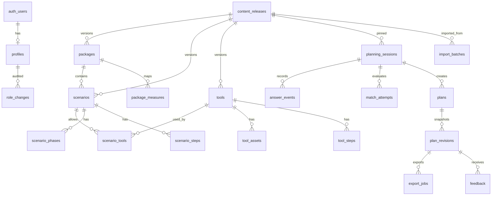

# ออกแบบฐานข้อมูล — AI นักขับเคลื่อนพื้นที่ปลอดบุหรี่ไฟฟ้า

> สถานะ: แบบออกแบบสำหรับพัฒนา ยังไม่ได้สร้างฐานข้อมูลหรือเชื่อม Supabase
> อ้างอิงหลัก: [PRD.md](PRD.md), [PRODUCT.md](PRODUCT.md) และไฟล์ข้อมูลต้นทางในโครงการ
> คำในวงเล็บเหลี่ยม **[เสนอ]** คือการตัดสินใจเชิงออกแบบที่ต้องยืนยันก่อนใช้จริง ส่วนตัวเลขจากข้อมูลต้นทางคือ baseline สำหรับตรวจการนำเข้า ไม่ใช่จำนวนที่ระบบต้องล็อกไว้ตลอดไป

## 1. เป้าหมายและขอบเขต

ฐานข้อมูลต้องรองรับการถามบริบทผู้ใช้ 5 มิติ, จับคู่สถานการณ์ด้วยกฎที่ตรวจสอบได้, สร้างแผนจากเนื้อหาที่รับรอง, ดาวน์โหลด PDF/ZIP, รับข้อเสนอแนะ, จัดการคลังข้อมูล/สมาชิก และทำรายงานรวม โดยแยกข้อมูลส่วนตัวออกจากคลังเนื้อหาและข้อมูลวิเคราะห์อย่างชัดเจน โค้ดปัจจุบันเชื่อม Supabase Auth แล้ว และนำเข้าไฟล์โครงการเป็น `draft + simulated` จำนวน 9 IP, 54 SC, 25 T. เจ้าของโครงการอนุญาตให้เปิดชุดนี้บนเว็บ; Server อ่านผ่าน service role เฉพาะ release ที่ `change_note = public-preview:simulated` โดย RLS ยังไม่เปิดให้ anon อ่านฉบับร่างโดยตรง. ตามคำขอล่าสุด หน้าเว็บและไฟล์ที่ระบบสร้างไม่เติมข้อความสถานะจำลอง แต่ PDF ต้นฉบับและสถานะฐานข้อมูลไม่ถูกแก้ไข. PDF อยู่ใน private bucket และส่งผ่าน Route Handler ที่ตรวจ release ก่อน. ZIP เครื่องมือปัจจุบันประกอบขณะดาวน์โหลดจากไฟล์ที่จับคู่กับสถานการณ์; ยังไม่มี export job, ประวัติ, หรือตารางไฟล์ส่งออกตามแบบออกแบบด้านล่าง. การเปิดใช้บนเว็บนี้ไม่เท่ากับสถานะ `approved` หรือการรับรองโดย สสส. ตาราง/งานสำหรับ Guest session, การบันทึกแผน, Feedback และ Dashboard เชิงพฤติกรรมยังเป็นแบบออกแบบในเอกสารนี้ ไม่ควรตีความว่าฟีเจอร์เหล่านั้นทำงานแล้ว

ใช้ Supabase PostgreSQL เป็นข้อมูลเชิงสัมพันธ์, Supabase Auth สำหรับบัญชีสมาชิก และ Supabase Storage สำหรับไฟล์จริง/ไฟล์ส่งออก ตารางที่เปิดผ่าน API ต้องเปิด RLS และกำหนดสิทธิ์อย่างเจาะจงตาม [เอกสาร Supabase RLS](https://supabase.com/docs/guides/database/postgres/row-level-security) ส่วนไฟล์ส่วนตัวให้ใช้ private bucket และ URL มีอายุ ตาม [เอกสาร Supabase Storage](https://supabase.com/docs/guides/storage/buckets/fundamentals)

### หลักออกแบบ

1. **รหัสธุรกิจไม่ใช่สิทธิ์เข้าถึง:** `SC-010`, `IP-02`, `T08` ใช้แสดง/อ้างอิงเท่านั้น; PK เป็น UUID และการอ่านแผนอาศัยเจ้าของหรือสิทธิ์ที่ตรวจบน Server
2. **ข้อมูลมีรุ่น:** ทุก IP/SC/T/ข้อความ/ขั้นตอน/ไฟล์ที่ใช้จับคู่ผูก `release_id` เดียวกัน; เผยแพร่ทั้งรุ่นแบบ atomic; แผนเก่าเก็บ snapshot ไม่เปลี่ยนตามการแก้คลัง
3. **แยกสามสถานะ:** วงจรเผยแพร่ (`draft` ฯลฯ), ความน่าเชื่อถือ (`simulated` ฯลฯ), ความพร้อมไฟล์ (`missing` ฯลฯ) ห้ามใช้คำว่า “มีเครื่องมือ” แทน “พร้อมเผยแพร่”
4. **จับคู่ด้วยข้อมูลโครงสร้าง:** `setting_code + package_code + operator_role_code + target_group_code + intervention_level` ต้องตรง SC ในรุ่นเดียวกัน AI อธิบายได้แต่เปลี่ยนกฎไม่ได้
5. **ข้อมูลเท่าที่จำเป็น:** ไม่เก็บชื่อเด็ก/ผู้ป่วย/ผู้สูบหรือประวัติสุขภาพในแผน; ข้อความอิสระและ Analytics ต้องไม่กลายเป็นช่องรับข้อมูลอ่อนไหวโดยไม่จำเป็น
6. **รหัสคนละมิติ:** `access_role` คือสิทธิ์บัญชี, `audience_context` คือ M/F/C/H, `setting_code` คือ S1/S2/S3, `measure_code` คือ MS, `strategy_code` คือ Ottawa; ไม่ใช้ร่วมคอลัมน์หรือแปลงแทนกัน

## 2. ภาพความสัมพันธ์

ภาพนี้ย่อความสัมพันธ์หลัก; FK ของตารางคลังใช้ `(release_id, code)` เพื่อป้องกันการอ้าง IP/SC/T คนละรุ่น ส่วน `auth_users` หมายถึง `auth.users` ของ Supabase ซึ่งควรอ้างด้วย PK `id` ตาม [คู่มือ User Management](https://supabase.com/docs/guides/auth/managing-user-data)

## 3. ข้อตกลงชนิดข้อมูล

| รูปแบบ | ใช้เมื่อ | กฎ |
|---|---|---|
| `uuid` | PK/FK ที่ไม่เปิดเผยลำดับ | `gen_random_uuid()`; รหัสธุรกิจเป็นคอลัมน์แยก |
| `text` + `CHECK` | สถานะที่มีค่าจำกัด | Migration ขยายค่าได้; ไม่ยัดหลายความหมายในสถานะเดียว |
| `timestamptz` | ทุกเวลา | เก็บ UTC; แสดงและตัดวันรายงานใน `Asia/Bangkok` |
| `jsonb` | Snapshot ผลลัพธ์/เงื่อนไข Branch ที่มี schema version | ตรวจด้วย application validator; ฟิลด์ที่ใช้ join/filter เป็นคอลัมน์ปกติ |
| `text` สำหรับ code | IP/SC/T/R/G/MS/S | คงเลขศูนย์นำหน้า; ไม่แปลงเป็น integer |
| `sha256` แบบ `text` | ไฟล์/Token/แหล่งข้อมูล | เก็บ digest เพื่อตรวจซ้ำ ไม่เก็บ Guest token ดิบ |

ทุกตารางงานหลักมี `created_at`, `updated_at` ตามความเหมาะสม; ตาราง audit/snapshot เพิ่มอย่างเดียวและไม่ให้ client แก้ย้อนหลัง. ไฟล์ใหญ่เก็บใน Storage; DB เก็บ path, hash, MIME, size, สิทธิ์, สถานะ และแหล่งที่มา

## 4. บัญชี สิทธิ์ และ Guest

| ตาราง | คอลัมน์หลัก | ข้อบังคับ/หน้าที่ |
|---|---|---|
| `profiles` | `user_id uuid PK FK -> auth.users.id`, `display_name text?`, `access_role text`, `account_status text`, `created_at`, `updated_at` | `access_role IN ('admin1','admin2','user')`; ค่าเริ่มต้น `user`; `account_status IN ('active','suspended')`; ไม่ให้ client แก้ role/status |
| `role_changes` | `id`, `target_user_id`, `actor_user_id`, `old_role`, `new_role`, `old_status`, `new_status`, `reason`, `created_at` | append-only; Admin1 เท่านั้น; การลดสิทธิ์/ระงับต้องตรวจทันทีฝั่ง Server ไม่รอ JWT หมดอายุ |
| `guest_sessions` | `id`, `token_hash UNIQUE`, `expires_at`, `last_seen_at`, `privacy_notice_version`, `revoked_at` | เก็บ token hash; cookie `HttpOnly`, `Secure`, `SameSite`; ตรวจ expiry/revocation ทุกคำขอ; อายุเป็น **[รอยืนยัน]** |
| `privacy_acceptances` | `id`, `user_id?`, `guest_session_id?`, `notice_version`, `purpose_code`, `accepted_at`, `withdrawn_at?` | หนึ่งเจ้าของต่อแถว; แยกการรับทราบกับ consent เฉพาะวัตถุประสงค์; ห้ามใช้ checkbox เดียวเหมารวม |

การสมัคร/เข้าสู่ระบบใช้ Supabase Auth; `profiles` เป็นข้อมูลแอปที่เชื่อมด้วย PK ของ `auth.users`. หากสร้าง profile ด้วย trigger ต้องทดสอบกรณี trigger ล้มเหลว เพราะอาจกระทบ signup ตาม [คู่มือ Supabase](https://supabase.com/docs/guides/auth/managing-user-data). **[เสนอ]** Guest ใช้ opaque token ที่ออกและตรวจโดย Next.js Server เท่านั้น จึงไม่มี direct client query ไปตาราง Guest. วิธีนี้ต้องมี rate limit และ CSRF protection; หากภายหลังเลือก Supabase anonymous Auth ให้ทบทวน schema/นโยบายอีกครั้ง

การป้องกัน Admin1 คนสุดท้ายถูกลดสิทธิ์หรือระงับ ต้องทำใน transaction ฝั่ง DB/Server พร้อม lock แถวที่เกี่ยวข้อง ไม่ตรวจแค่จำนวนจาก UI. `admin2` แก้เนื้อหาและดู Dashboard ได้ แต่จัดการสมาชิกไม่ได้. สิทธิ์แก้เนื้อหาไม่เท่ากับสิทธิ์รับรอง; ผู้รับรองยังเป็น **[รอยืนยัน]**. หากใช้ JWT custom claim เพื่อช่วย RLS ต้องคำนึงว่า claim เก่าอาจยังอยู่จนออก token ใหม่; การจัดการสมาชิกควรเช็กสถานะจริงใน DB ด้วย. Supabase มีแนวทาง [RBAC/custom claims](https://supabase.com/docs/guides/api/custom-claims-and-role-based-access-control-rbac)

## 5. รุ่นข้อมูลและแหล่งที่มา

| ตาราง | คอลัมน์หลัก | ข้อบังคับ/หน้าที่ |
|---|---|---|
| `content_releases` | `id`, `version_label UNIQUE`, `workflow_status`, `trust_status`, `source_manifest_hash`, `created_by`, `approved_by?`, `approved_at?`, `published_at?`, `revoked_at?`, `change_note` | `workflow_status IN ('draft','in_review','published','archived','revoked')`; `trust_status IN ('simulated','partially_verified','approved')`; รุ่นที่ published เปลี่ยนข้อมูลลูกไม่ได้ |
| `active_content_release` | `singleton_id smallint PK CHECK (=1)`, `release_id FK`, `activated_at`, `activated_by` | แถวเดียว; เปลี่ยน pointer ใน transaction หลัง validation; publish ล้มเหลวต้องคงรุ่นเดิม |
| `source_documents` | `id`, `source_key`, `original_name`, `kind`, `sha256`, `storage_path?`, `received_at`, `rights_status` | ต้นทาง Excel/PDF/ภาพ; ไฟล์นำเข้า private; ชื่อไฟล์ไม่ใช่ตัวระบุเฉพาะ |
| `source_refs` | `id`, `release_id`, `entity_type`, `entity_code`, `field_path`, `source_document_id`, `sheet_name?`, `row_no?`, `page_no?`, `note?` | provenance ระดับฟิลด์สำหรับข้อมูลอนุพันธ์/คำรับรอง |
| `import_batches` | `id`, `release_id?`, `idempotency_key UNIQUE`, `status`, `started_by`, `started_at`, `finished_at?`, `validation_report jsonb` | นำเข้า staging → validate → draft; ไม่ publish อัตโนมัติ; import ซ้ำไม่เกิด code ซ้ำ |
| `import_batch_files` | `batch_id`, `source_document_id`, `parser_version`, `row_count`, `error_count` | เก็บความสัมพันธ์ไฟล์กับรอบนำเข้า |
| `content_issues` | `id`, `release_id`, `issue_code`, `severity`, `entity_type`, `entity_code?`, `detail`, `status`, `resolved_by?`, `resolved_at?` | บันทึก DQ-01…DQ-22 และข้อผิดพลาดใหม่; hard blocker ต้องแก้/พักก่อน publish |
| `content_reviews` | `id`, `release_id`, `entity_type`, `entity_code?`, `field_scope?`, `decision`, `reviewer_id`, `evidence_ref?`, `note`, `created_at` | append-only; `decision IN ('approved','rejected','needs_changes')`; ห้าม import ตั้ง Approved เอง |
| `content_audit_logs` | `id`, `actor_user_id`, `release_id`, `entity_type`, `entity_code`, `action`, `before_hash?`, `after_hash?`, `reason`, `created_at` | append-only; ไม่เก็บบทสนทนาผู้ใช้ |

**กติกา publish:** clone รุ่นเดิมเป็น draft → นำเข้า/แก้ → ตรวจ FK และกฎธุรกิจ → รับรอง → เปิด Preview → เปลี่ยน `active_content_release` ใน transaction. หากถอนรุ่น/ไฟล์ ให้ห้ามการสร้างใหม่จากรุ่นนั้นทันที; session ที่ปักรุ่นเดิมต้องแสดงให้ทบทวน ส่วน revision เดิมยังเก็บ snapshot แต่การดาวน์โหลดไฟล์ที่ถูกถอนต้องหยุดตามสิทธิ์/คุณภาพ

## 6. คลังหมวดหมู่ แพ็กเกจ สถานการณ์ และเครื่องมือ

### 6.1 Dictionary และแพ็กเกจ

| ตาราง | คอลัมน์หลัก | ข้อบังคับ/หน้าที่ |
|---|---|---|
| `settings` | `release_id`, `code`, `name_th`, `sort_order`, `is_supported` | PK `(release_id,code)`; S1/S2/S3; S3 ไม่ถูกบังคับให้เท่ากับ M/F/C/H |
| `audience_contexts` | `release_id`, `code`, `name_th`, `description` | PK `(release_id,code)`; M/F/C/H; เป็นบริบทเข้าเว็บ ไม่ใช่ role สิทธิ์ |
| `operator_roles` | `release_id`, `code`, `name_th`, `aliases jsonb`, `support_status` | PK `(release_id,code)`; R codes; ต้องรองรับรหัสที่มี metadata แต่ยังไม่มี SC |
| `target_groups` | `release_id`, `code`, `name_th`, `aliases jsonb`, `support_status` | PK `(release_id,code)`; G codes; G06/G09 อาจยังไม่มี SC |
| `measures` | `release_id`, `code`, `title_th`, `description?` | PK `(release_id,code)`; MS แยกจาก M audience |
| `strategies` | `release_id`, `code`, `title_th`, `description?` | Ottawa strategy; ไม่บังคับ mapping กับ MS จนรับรอง |
| `measure_strategy_links` | `release_id`, `measure_code`, `strategy_code`, `review_status`, `source_ref_id?` | optional และต้องอนุมัติก่อนใช้เป็นกฎแนะนำ |
| `packages` | `release_id`, `code`, `setting_code`, `title_th`, `goal_th`, `description_th?`, `limitations_th?`, `trust_status` | PK `(release_id,code)`; FK setting รุ่นเดียวกัน; IP-09 ไม่มี MS ได้ |
| `package_measures` | `release_id`, `package_code`, `measure_code` | PK ทั้ง 3 คอลัมน์; ไม่บังคับอย่างน้อย 1 MS |
| `package_audiences` | `release_id`, `package_code`, `audience_code`, `entry_note?` | ทางเข้าของ M/F/C/H ใช้กรอง/อธิบาย; ไม่แก้กฎจับคู่ SC |

### 6.2 สถานการณ์และเนื้อหาแผน

| ตาราง | คอลัมน์หลัก | ข้อบังคับ/หน้าที่ |
|---|---|---|
| `scenarios` | `release_id`, `code`, `package_code`, `setting_code`, `operator_role_code`, `target_group_code`, `intervention_level`, `catalogue_status`, `content_status`, `is_enabled`, `readiness_note?` | PK `(release_id,code)`; `UNIQUE(release_id,setting_code,package_code,operator_role_code,target_group_code,intervention_level)`; level `prevention/cessation`; catalogue `primary_available/support_only/no_tool`; content `simulated/partially_verified/approved` |
| `scenario_phases` | `release_id`, `scenario_code`, `phase_no smallint`, `period_label`, `summary_th`, `source_ref_id?`, `trust_status` | PK `(release_id,scenario_code,phase_no)`; `phase_no BETWEEN 1 AND 4`; no-tool ไม่มี phase |
| `scenario_steps` | `id`, `release_id`, `scenario_code`, `phase_no`, `step_no`, `timing_th?`, `action_th`, `responsible_role_code?`, `tool_code?`, `place_th?`, `output_th?`, `preparation_th?`, `source_ref_id?` | `UNIQUE(release_id,scenario_code,step_no)`; FK phase/role/tool ในรุ่นเดียวกัน; no-tool ไม่มี step |
| `host_recommendations` | `id`, `release_id`, `scenario_code`, `tool_code?`, `host_role_code?`, `context_rule jsonb?`, `text_th`, `trust_status`, `source_ref_id?` | เสริมอย่างเดียวต้องมีเจ้าภาพที่ Approved และตรงบริบท; SC-052/054 ต้องพักจนยืนยัน |
| `referrals` | `id`, `release_id`, `package_code?`, `scenario_code?`, `label_th`, `destination_type`, `destination_value?`, `verified_at?`, `verified_by?`, `status` | ลิงก์/เบอร์ติดต่อ/แนวส่งต่อ; ใช้จริงเมื่อ verified และปลายทางยังใช้งานได้ |

`setting_code` ใน `scenarios` ควรตรวจให้ตรงกับ package ที่อ้างด้วย trigger/validation ระหว่าง publish. สำหรับ S2 ที่ครอบครัวและสุขภาพใช้ร่วมกัน ให้เก็บ `audience_context` ใน session และ `package_audiences` แยก ไม่สร้าง SC ปลอมเพื่อให้เท่าจำนวนบริบท. ความสัมพันธ์ `SC -> IP/R/G/level` ต้องอ้าง dictionary รุ่นเดียวกัน

### 6.3 เครื่องมือและไฟล์

| ตาราง | คอลัมน์หลัก | ข้อบังคับ/หน้าที่ |
|---|---|---|
| `tools` | `release_id`, `code`, `title_th`, `description_th?`, `tool_kind`, `lifecycle_status`, `trust_status`, `default_owner_role_code?`, `limitations_th?` | PK `(release_id,code)`; T02/T03/T17 เก็บประวัติได้แต่ไม่ active โดยอัตโนมัติ |
| `tool_aliases` | `release_id`, `tool_code`, `alias`, `source_ref_id?` | `UNIQUE(release_id,tool_code,alias)`; ชื่อใกล้กันไม่ใช้แทน code |
| `tool_assets` | `id`, `release_id`, `tool_code`, `asset_kind`, `storage_bucket?`, `storage_path?`, `external_url?`, `mime_type?`, `byte_size?`, `sha256?`, `availability_status`, `rights_status`, `is_original`, `verified_at?`, `revoked_at?` | แยกการ์ดจำลอง/คู่มือจริง/URL/อุปกรณ์/วิธีติดต่อ; status `missing/available/external/physical/unavailable`; path ไม่ใช่ public URL |
| `scenario_tools` | `release_id`, `scenario_code`, `tool_code`, `slot`, `display_order`, `start_order?`, `reason_th?`, `reason_status`, `applicability_rule jsonb?`, `source_ref_id?` | PK `(release_id,scenario_code,tool_code,slot)`; slot `primary/supporting/measurement/reference`; FK SC/T รุ่นเดียวกัน; `UNIQUE(release_id,scenario_code,slot,display_order)`; start order แยกจาก slot |
| `tool_steps` | `id`, `release_id`, `tool_code`, `step_no`, `timing_th?`, `action_th`, `responsible_role_code?`, `preparation_th?`, `indicator_th?`, `source_ref_id?` | `UNIQUE(release_id,tool_code,step_no)`; รายละเอียดเครื่องมือไม่คัดลอกไปทุก SC |
| `tool_applicability` | `id`, `release_id`, `tool_code`, `rule_type`, `rule_json jsonb`, `review_status`, `source_ref_id?` | เงื่อนไข เช่น T14; จะมีผลต่อ matching เมื่อ schema rule และข้อมูลได้รับอนุมัติเท่านั้น |

หนึ่ง SC มี T ได้หลายตัวและ T เดียวอยู่คนละ slot ในคนละ SC ได้. `scenario_tools` เป็นรายการอนุญาตสูงสุด ไม่เพิ่มจากข้อความระดับ IP, ความสัมพันธ์ “ใช้คู่กับ” หรือ AI. เหตุผลที่ยังขาด 26 คู่ต้องถูกบันทึกเป็น issue ไม่ใช้การลบแถว T แก้จำนวนให้ลงตัว. เครื่องมือวัดผล/อ้างอิงไม่ถูกยกระดับเป็นกิจกรรมหลักเพื่อปิดช่องว่าง

### 6.4 คำถามและข้อความหน้าเว็บ

| ตาราง | คอลัมน์หลัก | ข้อบังคับ/หน้าที่ |
|---|---|---|
| `question_templates` | `id`, `release_id`, `template_key`, `version`, `title_th`, `status` | ผูก session กับ template version; เผยแพร่พร้อม release |
| `questions` | `id`, `template_id`, `question_key`, `answer_field`, `prompt_th`, `sort_order`, `required`, `branch_rule jsonb?` | 5 มิติหลัก; conditional question เพิ่มได้; branch rule ต้องตรวจ schema และ preview |
| `question_options` | `id`, `question_id`, `value_code`, `label_th`, `description_th?`, `sort_order`, `availability_rule jsonb?` | Option ผูก dictionary ที่มีจริง; “ยังไม่ตรง” เป็นค่าเฉพาะเพื่อถามต่อ ไม่ใช่ R/G ปลอม |
| `content_snippets` | `id`, `release_id`, `key`, `locale`, `body`, `trust_status`, `source_ref_id?` | FAQ, ข้อจำกัด, ข้อความ no-tool, ข้อความผลลัพธ์; แยกข้อความหน้าเว็บจากกฎจับคู่ |

## 7. การตอบคำถาม การจับคู่ และการสร้างแผน

| ตาราง | คอลัมน์หลัก | ข้อบังคับ/หน้าที่ |
|---|---|---|
| `planning_sessions` | `id`, `owner_user_id?`, `guest_session_id?`, `release_id`, `question_template_id`, `status`, `audience_context?`, `started_at`, `last_seen_at`, `expires_at?`, `is_preview` | เจ้าของ **อย่างใดอย่างหนึ่ง**; `status IN ('draft','confirmed','completed','expired','revoked')`; pin release ตอนเริ่ม |
| `session_answers` | `session_id PK`, `setting_code?`, `package_code?`, `operator_role_code?`, `target_group_code?`, `intervention_level?`, `audience_context?`, `subcontext_code?`, `timeline_months?`, `timeline_source?`, `updated_at` | ฟิลด์จับคู่ typed; `timeline_source IN ('system_default','user_provided')`; ค่าเริ่มต้น 3 เดือนไม่อ้างว่าผู้ใช้ตอบ |
| `answer_events` | `id`, `session_id`, `question_key`, `old_value jsonb?`, `new_value jsonb`, `created_at` | ใช้ตรวจย้อน/แก้คำตอบ; กำหนดอายุเก็บสั้นกว่าแผน **[รอยืนยัน]** |
| `chat_messages` | `id`, `session_id`, `sender`, `body`, `redaction_status`, `created_at`, `expires_at` | **[เสนอ: เฉพาะเมื่อฟีเจอร์จำเป็น]**; จำกัดความยาว, กรอง PII, ไม่ส่งเข้า Analytics/Audit; ข้อความระบบอ้าง template key ได้แทนเก็บซ้ำ |
| `match_attempts` | `id`, `session_id`, `release_id`, `answers_hash`, `result_status`, `scenario_code?`, `reason_code?`, `created_at` | status `primary_available/support_only/no_tool/unsupported/content_not_ready/system_error`; SC nullable เฉพาะกรณีไม่พบ; เก็บการตัดสินแบบตรวจสอบได้ |
| `generation_runs` | `id`, `session_id`, `match_attempt_id`, `idempotency_key`, `status`, `prompt_version?`, `model_id?`, `validator_version`, `error_code?`, `attempt_count`, `started_at`, `finished_at?` | `UNIQUE(session_id,idempotency_key)`; ไม่ log prompt หรือข้อความส่วนตัวทั้งก้อน; AI error ไม่ถูกนับเป็น no-tool |
| `plans` | `id`, `owner_user_id?`, `guest_session_id?`, `origin_session_id`, `display_code UNIQUE?`, `created_at`, `deleted_at?` | เจ้าของหนึ่งแบบ; display code ไม่ใช้เปิดสิทธิ์; **[เสนอ]** 1 session อาจสร้าง plan เดิมหลาย revision |
| `plan_revisions` | `id`, `plan_id`, `revision_no`, `release_id`, `scenario_code`, `package_code`, `match_status`, `context_snapshot jsonb`, `result_snapshot jsonb`, `result_schema_version`, `validator_version`, `generation_run_id?`, `validated_at`, `created_at`, `withdrawal_notice?` | `UNIQUE(plan_id,revision_no)`; immutable; result ต้องผ่าน validator; no-tool/unsupported ไม่มี revision “พร้อมใช้” |

`result_snapshot` เก็บข้อมูลที่ใช้วาดผลลัพธ์/PDF โดยตรง: รหัสและชื่อที่ตรวจแล้ว, สถานะ, เครื่องมือทุก slot, เหตุผล, เจ้าภาพ, 4 ช่วง, ขั้นตอน, ข้อจำกัด, provenance, timeline source. ใช้ JSONB เพราะเป็นเอกสารผลลัพธ์ที่ต้องคงรูปตามรุ่น; คีย์ที่ใช้รายงาน (`release_id`, `scenario_code`, `match_status`) ยังเป็นคอลัมน์ปกติ. การแก้คำตอบสำคัญสร้าง `match_attempt` ใหม่และ `plan_revision` ใหม่เมื่อได้แผนใหม่ ไม่เขียนทับ revision เก่า

`no_tool` และ `unsupported` บันทึก `match_attempts`/`gap_events` ได้โดยไม่สร้างแผนพร้อมใช้. `support_only` จะสร้าง revision ได้เมื่อ host/reason/content ผ่าน gate. ทุกผลลัพธ์ AI ตรวจ SC/T/slot/เวลา/บริบท/สถานะเนื้อหาก่อนบันทึก. หาก AI ไม่พร้อม ใช้ template ที่รับรองเมื่อข้อมูลครบ; หาก validation ล้มเหลวให้ retry จำกัดครั้งและเก็บ error code

## 8. การส่งออก ความเห็น และการวิเคราะห์

| ตาราง | คอลัมน์หลัก | ข้อบังคับ/หน้าที่ |
|---|---|---|
| `export_jobs` | `id`, `plan_revision_id`, `format`, `idempotency_key`, `status`, `error_code?`, `attempt_count`, `requested_at`, `finished_at?`, `expires_at?` | `format IN ('pdf','zip')`; `UNIQUE(plan_revision_id,format,idempotency_key)`; retry สร้างจาก revision เดิม |
| `export_files` | `id`, `export_job_id`, `storage_bucket`, `storage_path`, `mime_type`, `byte_size`, `sha256`, `manifest jsonb?`, `created_at`, `revoked_at?` | private bucket; ZIP manifest ระบุ asset รุ่น/ลำดับ/hash; ถ้าไฟล์เครื่องมือถูกถอนต้องไม่แจกต่อ |
| `feedback_tokens` | `id`, `plan_revision_id`, `token_hash UNIQUE`, `expires_at`, `revoked_at?` | Token สำหรับส่ง feedback แยกจากสิทธิ์อ่าน plan; ใช้แล้ว/หมดอายุได้ตามนโยบาย |
| `feedback` | `id`, `plan_revision_id`, `token_id?`, `idempotency_key`, `usage_status`, `barrier_codes text[]`, `missing_need_text?`, `created_at` | `UNIQUE(plan_revision_id,idempotency_key)`; usage `not_started/in_progress/used/unable`; ตัวเลือก T ต้องอยู่ใน revision; ข้อความอิสระจำกัด/กรอง PII |
| `feedback_tools` | `feedback_id`, `tool_code`, `used_status` | PK `(feedback_id,tool_code)`; ตรวจ tool จาก revision ไม่ใช่คลังล่าสุด |
| `gap_events` | `id`, `match_attempt_id`, `session_id`, `release_id`, `scenario_code?`, `gap_type`, `recorded_at` | บันทึก no-tool/unsupported/ขาดเนื้อหาแยกจากระบบล้มเหลว; แสดง “บันทึกแล้ว” หลัง commit สำเร็จ |
| `product_events` | `id`, `event_name`, `session_id?`, `plan_revision_id?`, `release_id?`, `scenario_code?`, `source`, `occurred_at`, `properties jsonb` | event allowlist จาก PRD; event ID กันซ้ำ; ไม่มี chat/email/ชื่อ/ข้อมูลสุขภาพใน properties |
| `report_daily` | `report_date`, `release_id?`, `setting_code?`, `scenario_code?`, `metric_key`, `metric_value`, `calculated_at` | **[เสนอ]** ตารางสรุป/Materialized view จาก event จริง; exclusion preview/admin test; suppress กลุ่มเล็กตาม threshold ที่รับรอง |

นิยาม Dashboard ต้องคงตาม PRD: session เริ่มเมื่อเริ่มตอบจริง, match สำเร็จรวม no-tool ที่ตอบตามคลัง, แผนสำเร็จเฉพาะผ่าน validator, download success คือ Server สร้างและส่งไฟล์ได้ ไม่ใช่ผู้ใช้เปิดอ่าน. Guest unique นับเป็น session/browser identifier ไม่อ้างว่าเป็นคนจริงข้ามอุปกรณ์. feedback คือรายงานตนเอง ไม่ใช่ผลตรวจภาคสนาม. ใช้ `Asia/Bangkok` สำหรับวันรายงานและระบุวันตัดยอด

## 9. กฎเชิงสัมพันธ์และ readiness gate

กฎที่ทำด้วย PK/FK/UNIQUE/CHECK ให้บังคับใน DB; กฎที่อาศัยข้อมูลหลายตารางให้ตรวจใน publish transaction และ generation validator พร้อมชุดทดสอบอัตโนมัติ

| กฎ | วิธีบังคับ |
|---|---|
| SC, IP, R, G, T และ step ทั้งหมดต้องอยู่ release เดียวกัน | composite FK `(release_id,code)`; ห้าม join ด้วย code เดี่ยว |
| คู่ 5 มิติซ้ำไม่ได้ในรุ่นเดียว | `UNIQUE` บน `scenarios` ตามตารางด้านบน |
| `primary_available` ต้องมี T slot `primary`; `support_only` ไม่มี primary แต่มี supporting; `no_tool` ไม่มี scenario_tool/phase/step | ตรวจแบบ deferred/publish validator; mutation draft อาจยังไม่ครบระหว่างแก้ |
| เครื่องมือที่แสดงต้องเป็นแถวใน SC–T; ไม่ตกหล่นหลาย primary | result validator เทียบชุดกับ `scenario_tools`; ห้าม truncate UI เป็น data rule |
| ทุก asset ที่จำเป็นต้องพร้อมและมีสิทธิ์ใช้ | ตรวจ `tool_assets`, MIME/hash/rights/availability; card จำลองไม่แทนคู่มือจริง |
| เนื้อหาที่เผยแพร่ต้อง Approved จริง | ตรวจ release + entity + reason/host/phase/step/referral ที่จำเป็น; import ไม่ยกระดับ trust |
| support-only ต้องมีเจ้าภาพรับรองในบริบทนั้น | publish/generation gate; มิฉะนั้น `content_not_ready` |
| IP-08 ใช้ cessation เท่านั้น, T14 ต้องมีเงื่อนไขที่รับรอง, T24/T11 ไม่ auto-add | rule validator เฉพาะข้อมูล; บันทึก test cases ตาม DQ |
| 3 เดือนเป็นค่าเริ่มต้น ไม่ใช่คำตอบผู้ใช้ | `timeline_source` และ snapshot แสดงที่มา |
| plan revision/export ใช้ release เดิม; ไม่มีไฟล์ข้ามรุ่น | FK/snapshot + manifest validator |
| ถอนเนื้อหาแล้วหยุดการใช้ใหม่/ไฟล์ที่มีปัญหา | ตรวจ revocation ใน API ทุกครั้งก่อน issue URL |

สถานะที่ต้องแยกใน API/UI: `primary_available`, `support_only`, `no_tool`, `unsupported`, `content_not_ready`, `system_error`. `no_tool` เป็นผลของข้อมูล ไม่ใช่ความล้มเหลวระบบ. ห้ามสร้าง ZIP ว่างหรือแผน 4 ช่วงหลอกในกรณี no-tool; PDF สรุปช่องว่างเป็นทางเลือกที่ต้องยืนยันชื่อ/รูปแบบ

## 10. RLS และ API access

| กลุ่มข้อมูล | Guest | User เจ้าของ | Admin1 | Admin2 | Server/worker |
|---|---|---|---|---|---|
| คลัง Published + Approved ที่เปิดสาธารณะ | อ่านเฉพาะ view/API ที่ผ่าน gate | อ่าน | อ่าน | อ่าน | อ่าน |
| Draft/import/issues/review/audit เนื้อหา | ไม่มี | ไม่มี | อ่าน/แก้ตาม workflow | อ่าน/แก้ตาม workflow | จัดการผ่าน service operation |
| Profiles/member audit | ไม่มี | อ่าน/แก้ข้อมูลตนที่อนุญาต | จัดการบัญชี | ไม่มีสิทธิ์จัดการสมาชิก | ทำงานตามคำสั่งที่ตรวจสิทธิ์ |
| Session/answers/chat/plans/feedback รายบุคคล | เฉพาะ server ตรวจ guest token | เฉพาะของตน | **ไม่มีโดยปริยาย** | **ไม่มีโดยปริยาย** | เฉพาะงานที่ได้รับมอบ |
| Dashboard aggregate | ไม่มี | ไม่มี | อ่าน | อ่าน | คำนวณ |
| Export/private files | URL อายุสั้นหลังตรวจ token | URL อายุสั้นหลังตรวจ owner | ไม่ได้อ่านไฟล์ผู้ใช้โดยปริยาย | ไม่ได้อ่านไฟล์ผู้ใช้โดยปริยาย | สร้าง/ตรวจ/เพิกถอน |

**การบังคับใช้:** ทุกตารางใน exposed schema เปิด RLS, จำกัด GRANT, เขียน policy แยก `SELECT/INSERT/UPDATE/DELETE` และทดสอบ `anon`, `authenticated`, suspended, admin1/admin2. RLS ของ user row ตรวจ `auth.uid() = owner_user_id`; `auth.uid()` เป็น `null` เมื่อไม่ได้ยืนยันตัวตนตาม [Supabase RLS](https://supabase.com/docs/guides/database/postgres/row-level-security). Guest ไม่มี policy เปิดอ่าน private row ตรง ๆ; ใช้ Server route ที่ตรวจ hash token, expiry, ownership, rate limit ก่อนเรียก DB. Service role key อยู่ Server เท่านั้น และทุก endpoint ตรวจสิทธิ์ของผู้ร้องก่อนใช้สิทธิ์สูง. หากใช้ `SECURITY DEFINER` ต้องจำกัด owner/search_path/EXECUTE อย่างเข้มงวด; เอกสาร Supabase เตือนเรื่องสิทธิ์กว้างของ definer ใน [Auth Hooks](https://supabase.com/docs/guides/auth/auth-hooks)

Storage เสนอ bucket `source-private` (ต้นทาง), `tool-private` (คู่มือจริง) และ `exports-private` (PDF/ZIP). ไม่เก็บ PDF ส่วนตัวใน public bucket. ออก signed URL หลังตรวจสิทธิ์และอายุสั้น; การถอนแบบทันทีต้องควบคุมที่จุดออก URL/เส้นทาง proxy และอายุ URL เพราะ signed URL ที่ออกไปแล้วอาจใช้ได้จนหมดอายุ ดู [การดาวน์โหลดจาก Storage](https://supabase.com/docs/guides/storage/serving/downloads)

## 11. ดัชนีและขนาดข้อมูล

| ดัชนี | เหตุผล |
|---|---|
| unique `scenarios(release_id,setting_code,package_code,operator_role_code,target_group_code,intervention_level)` | exact match 5 มิติและกันซ้ำ |
| `scenario_tools(release_id,scenario_code,slot,display_order)` | ประกอบแผนทุก slot ตามลำดับ |
| `tool_assets(release_id,tool_code,availability_status)` | readiness/export manifest |
| `planning_sessions(owner_user_id,last_seen_at DESC)` และ `(guest_session_id,last_seen_at DESC)` | ประวัติ/หมดอายุของเจ้าของ |
| `plan_revisions(plan_id,revision_no DESC)` | revision ล่าสุดโดยไม่แก้ของเก่า |
| `export_jobs(plan_revision_id,format,status)` | โหลด/ retry งานส่งออก |
| `product_events(occurred_at,event_name)` และ `(release_id,scenario_code,occurred_at)` | aggregate/funnel; พิจารณา partition เมื่อปริมาณจริงสูง |
| `content_issues(release_id,status,severity)` | publish gate/backlog |

PK/UNIQUE สร้างดัชนีอยู่แล้ว ไม่สร้างซ้ำ. อย่า index JSONB ทั้งก้อนตั้งแต่แรก; เพิ่มเฉพาะ query ที่วัดแล้ว. สำหรับ MVP ปริมาณคลัง 54 SC เล็กมาก การ query แบบ exact join เพียงพอ ไม่ต้องใช้ vector DB/RAG เป็นเงื่อนไข

## 12. ลำดับงานที่ควรพัฒนา

1. สร้าง migration schema, constraints, RLS และ automated policy tests; ตั้ง private buckets และสิทธิ์ Storage
2. เขียน importer ที่แปลงไฟล์ต้นทางเป็น staging, เก็บ provenance, report diff/issue และตรวจ baseline โดยไม่ publish
3. นำเข้ารุ่นแรกเป็น `simulated/draft`; ตรวจตัวเลข baseline **9 IP, 54 SC, 25 T, 16 R ใน SC, 41/10/3 status, S1/S2/S3 = 22/28/4, 54 summaries, 306 route steps, 100 tool steps**; ตัวเลขนี้เป็น regression check สำหรับไฟล์ชุดนี้
4. ทำ CMS/Preview/approval และ publish gate; ยังไม่เปิด Production ที่มีไฟล์จำลองหรือข้อขัดแย้งค้าง
5. ทำ Auth/Guest session, คำถาม 5 มิติ, exact matcher, generation validator, immutable revision
6. ทำ export worker, signed URL, feedback/gap event และรายงานรวม พร้อม retention jobs

### ชุดทดสอบสำคัญ

- SC-010 ต้องได้ T08/T16 และ T09/T12 ตาม slot; ไม่เพิ่ม T18 จากภาพตัวอย่าง
- SC-003 แสดง primary ทุกชิ้นรวม T05; SC-014/021 คง T19 เป็น supporting
- SC-017/020/023 เป็น no-tool ไม่มี timeline/step/ZIP พร้อมใช้
- SC-052/054 ไม่เผย host ที่ผิดบริบท; SC-024/025 ไม่เผยขั้นตอนครูเป็นของผู้ปกครองโดยไม่แก้ข้อมูล
- IP-08 ไม่สร้างเส้นทาง prevention; T02/T03/T17 ไม่ active; T14 ไม่ถูกใส่ทุกกรณีโดยอัตโนมัติ
- Guest token หมดอายุ/ถูกถอน, User A อ่านแผน User B ไม่ได้, Admin2 แก้สมาชิกไม่ได้, Admin ทั้งสองอ่านบทสนทนาส่วนตัวไม่ได้, suspended account ใช้งาน session เดิมไม่ได้
- เปลี่ยน active release ระหว่างสร้างแผนแล้วทุกส่วนยังใช้รุ่นเดียว; ถอน asset แล้วไม่ออก URL ใหม่; retry export/feedback/generation ด้วย key เดิมไม่เกิดข้อมูลซ้ำ

## 13. นโยบายที่ต้องตกลงก่อน Production

| ประเด็น | ค่าเริ่มต้นที่เสนอ / เหตุที่ต้องยืนยัน |
|---|---|
| Guest-first และอายุ token/session | PRD เสนอ Guest ใช้ได้แต่ยังไม่รับรองนโยบาย; กำหนด expiry/renewal/การลบบนอุปกรณ์ร่วม |
| ระยะเก็บข้อมูล | แยก Chat, Context, Plan, PDF/ZIP, Analytics, Feedback, Audit, Backup; ยังไม่มีตัวเลขที่อนุมัติ จึงไม่ hardcode ใน schema |
| เยาวชนและข้อความอิสระ | ยืนยันอายุ/รูปแบบ consent และผู้รับผิดชอบ; UI ควรไม่ขอข้อมูลสุขภาพรายบุคคล |
| ผู้รับรองเนื้อหา | Admin1/Admin2 แก้ได้ตาม requirement แต่ผู้อนุมัติ/การแยกผู้ร่างกับผู้อนุมัติยังไม่ตกลง |
| ไฟล์เครื่องมือจริงและสิทธิ์เผยแพร่ | PDF การ์ดที่มีในโปรเจคเป็นตัวอย่างจำลอง; ต้องได้ไฟล์และสิทธิ์ก่อนเปลี่ยนเป็น Approved |
| S3 กับ M/F/C/H; family/health route | ไม่สรุปว่ารหัสเหล่านี้เท่ากัน; ให้ผู้ถือ requirement รับรอง mapping |
| Ottawa strategy ↔ MS, referrals, T14, T15, SC-052/054 | ยังมีช่องว่าง/ข้อขัดแย้งใน PRD; เก็บ issue และ block เฉพาะเส้นทางที่กระทบ |
| เกณฑ์ซ่อนกลุ่มขนาดเล็กใน Dashboard | ต้องยืนยัน threshold และมิติที่ยอมให้เจาะลง; Admin ไม่มีสิทธิ์เห็นแผนส่วนตัวเพียงเพราะดู Dashboard |
| งาน PDF no-tool, ระยะเก็บ ZIP, ขนาดไฟล์ | ยืนยันรูปแบบและภาระ Storage/worker ก่อนกำหนด SLA |

## 14. เอกสารอ้างอิงทางเทคนิค

- [Supabase: Row Level Security](https://supabase.com/docs/guides/database/postgres/row-level-security)
- [Supabase: User Management และการเชื่อม `auth.users`](https://supabase.com/docs/guides/auth/managing-user-data)
- [Supabase: Custom Claims และ RBAC](https://supabase.com/docs/guides/api/custom-claims-and-role-based-access-control-rbac)
- [Supabase: Storage Buckets](https://supabase.com/docs/guides/storage/buckets/fundamentals)
- [Supabase: Storage Access Control](https://supabase.com/docs/guides/storage/security/access-control)
- [Supabase: Serving private assets](https://supabase.com/docs/guides/storage/serving/downloads)
